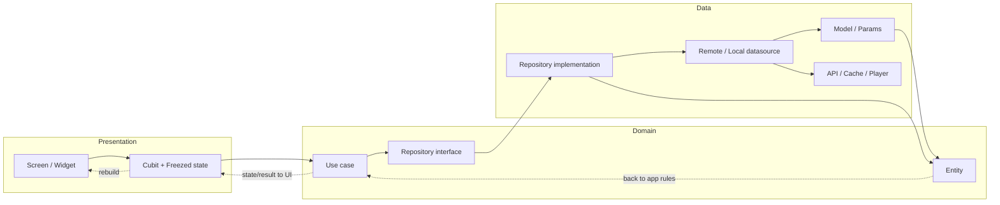
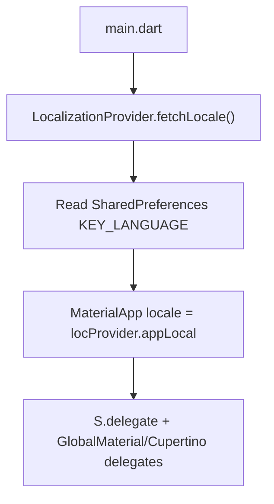
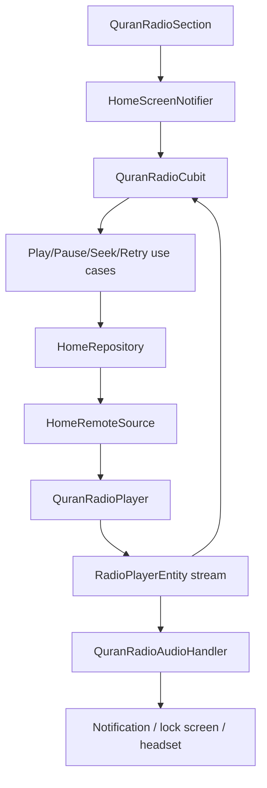

# Sakeenah · سكينة

<p align="center">
  <a href="https://github.com/Ammourie/Mobile/releases/latest">
    
  </a>
</p>

<p align="center">
  <a href="README.md"><strong>Overview</strong></a>
  &nbsp;·&nbsp;
  <a href="README.en.md"><strong>English</strong></a>
  &nbsp;·&nbsp;
  <strong>العربية</strong>
</p>

---

<a id="table-of-contents"></a>

## جدول المحتويات

انتقل مباشرة إلى:

- [عن التطبيق](#about)
- [Flutter و FVM](#flutter-fvm)
- [التثبيت](#install)
- [التحميل](#download)
- [التشغيل](#run)
- [بنية الـ TDD](#architecture)
- [قواعد Cursor](#cursor)
- [أهم الـ Packages](#packages)
- [الترجمة (Localization)](#localization)
- [الثيمات (Themes)](#themes)
- [التنقل (Routing)](#routing)
- [مواقيت الصلاة](#prayer-times)
- [راديو القرآن](#quran-radio)
- [مراحل التوثيق](#phases)

---

<a id="about"></a>

## عن التطبيق

**سكينة (Sakeenah)** تطبيق Flutter بسيط وموثوق، مخصص للاستخدام الإسلامي اليومي، ويجمع بين ميزتين أساسيتين:

- **مواقيت الصلاة** — أوقات صلاة دقيقة مبنية على الموقع الجغرافي، مع إبراز الصلاة القادمة، ودعم التخزين المؤقت للعمل بدون اتصال بالإنترنت.
- **راديو القرآن** — بث مباشر للتلاوة، مع أزرار Play/Pause، تحكم بمستوى الصوت، تخطي، وإمكانية seek داخل الـ buffer، إضافة إلى **تشغيل في الخلفية (background playback)** مع عناصر تحكم في شاشة القفل والإشعارات.

يدعم التطبيق **اللغتين الإنجليزية والعربية (RTL)**، **الوضعين الفاتح والداكن**، وواجهة Material 3 نظيفة مبنية على Clean Architecture (data / domain / presentation).

| | |
|---|---|
| **Package name** | `com.ammourie.sakeenah` |
| **Version** | `1.0.0+1` |
| **Repository** | [github.com/Ammourie/Mobile](https://github.com/Ammourie/Mobile) |

---

<a id="flutter-fvm"></a>

## Flutter و FVM

يعتمد هذا المشروع على **[FVM](https://fvm.app/)** (Flutter Version Management) حتى يبني الجميع المشروع بنفس إصدار Flutter.

| Tool | Version / note |
|------|----------------|
| **Flutter** | `3.44.0` (راجع [`.fvmrc`](.fvmrc)) |
| **Dart SDK** | `^3.10.0` (راجع [`pubspec.yaml`](pubspec.yaml)) |

**لماذا FVM؟** تثبيت إصدار محدد للـ SDK يمنع مشاكل "يعمل عندي ولا يعمل عند غيري" عندما يستخدم أحد الزملاء أو الـ CI إصدار Flutter مختلف.

**تثبيت FVM** (مرة واحدة فقط على كل جهاز):

```bash
dart pub global activate fvm
```

ثم من داخل مجلد المشروع:

```bash
fvm install 3.44.0
fvm use 3.44.0
```

---

<a id="install"></a>

## التثبيت

### المتطلبات

- [Git](https://git-scm.com/)
- [FVM](https://fvm.app/documentation/getting-started/installation) مع Flutter `3.44.0` (عبر `fvm install` أعلاه)
- **Android:** Android Studio، الـ SDK، وجهاز حقيقي أو emulator
- **iOS (على macOS فقط):** Xcode و CocoaPods

### الخطوات

```bash
# 1. Clone
git clone https://github.com/Ammourie/Mobile.git
cd Mobile

# 2. Flutter SDK (FVM)
fvm install
fvm use

# 3. Dependencies
fvm flutter pub get

# 4. Code generation (مطلوب بعد الـ clone أو أي تعديل على model/DI)
fvm dart run build_runner build --delete-conflicting-outputs
fvm dart run intl_utils:generate

# 5. لمستخدمي iOS فقط
cd ios && pod install && cd ..
```

> **ملاحظة:** أي تعديل native (Android manifest، iOS plist، أو إضافة plugin جديد) يتطلب **full app restart** — الـ hot reload وحده لا يكفي.

---

<a id="download"></a>

## التحميل

يتم نشر ملفات APK الجاهزة على GitHub Releases.

<p align="center">
  <a href="https://github.com/Ammourie/Mobile/releases/latest">
    
  </a>
</p>

| | |
|---|---|
| **All releases** | [github.com/Ammourie/Mobile/releases](https://github.com/Ammourie/Mobile/releases) |
| **Install on device** | `adb install path/to/app-release.apk` |

---

<a id="run"></a>

## التشغيل

```bash
# List devices
fvm flutter devices

# Debug (default)
fvm flutter run

# Release mode on device
fvm flutter run --release

# Build release APK
fvm flutter build apk --release
# Output: build/app/outputs/flutter-apk/app-release.apk

# Build App Bundle (Play Store)
fvm flutter build appbundle --release
```

---

<a id="architecture"></a>

## بنية الـ TDD لكل feature

يعتمد المشروع على **TDD Clean Architecture** — أي ثلاث layers لكل feature، تُربط دائماً **من الأعلى إلى الأسفل** عند إضافة قدرة جديدة:

```
presentation  →  domain  →  data
   (UI)         (rules)    (API / cache / engines)
```

### مسار الـ layers



| Layer | Folder | المسؤولية |
|-------|--------|-----------|
| **Presentation** | `presentation/` | الـ Screens والـ widgets، **Cubit** مع **Freezed state**، وأحداث المستخدم |
| **Domain** | `domain/` | **Entities**، **repository interfaces**، و**use cases** (قواعد التطبيق) |
| **Data** | `data/` | **Models**، **params**، **datasources**، و**repository impl** |

### إضافة use case جديد (الترتيب مهم)

اتبع هذا التسلسل بالضبط:

1. **Entity** — `domain/entity/xxx_entity.dart` (Dart خالص، يرث من `BaseEntity`)
2. **Model** — `data/request/model/xxx_model.dart` (يرث من `BaseModel`، مع `fromMap` و`toEntity`، ودوال validation للأنواع)
3. **Params** — `data/request/param/xxx_params.dart` (فقط إذا كان الطلب يحتاج مدخلات)
4. **DataSource** — دالة جديدة على `IXxxRemoteDataSource` مع التنفيذ الفعلي
5. **Repository** — دالة جديدة على `IXxxRepository` / `XxxRepository` (تُرجع `Either<AppErrors, Entity>`)
6. **Use case** — `domain/usecase/xxx_usecase.dart` (بـ `@injectable`، يرث من `UseCase`)
7. **Cubit** — يستدعي الـ use case ويصدر (emit) الـ Freezed state المناسب

### هيكل المجلدات لكل feature

```
lib/features/<feature>/
├── data/
│   ├── datasource/       # remote/local sources, players, handlers
│   └── request/
│       ├── model/        # JSON → Model → Entity
│       └── param/        # request bodies / query params
├── domain/
│   ├── entity/
│   ├── repository/       # IRepository + Repository
│   └── usecase/
└── presentation/
    ├── screen/
    ├── widgets/
    └── state_m/
        └── cubit/        # Cubit + freezed state (part files)
```

### الاتفاقية الخاصة بـ feature الـ Home

مواقيت الصلاة وراديو القرآن يشتركان في **repository stack واحد** تحت `lib/features/home/` (بدون module منفصل باسم `quran_radio`). راجع [`.cursor/rules/home-single-layers.mdc`](.cursor/rules/home-single-layers.mdc).

```dart
// ✅ الطريقة الصحيحة: UI → cubit → use case → repository → datasource
quranRadioCubit.playRadio();

// ❌ خطأ: widget يستدعي الـ player أو الـ API مباشرة
await quranRadioPlayer.play();
```

### إدارة الـ State

- **Cubit + Freezed** لبناء union states (`initial`, `loading`, `loaded`, `error`) — راجع [`.cursor/rules/freezed-cubit-states.mdc`](.cursor/rules/freezed-cubit-states.mdc)
- **GetIt + Injectable** لحقن الاعتماديات (DI) داخل `lib/di/`
- **Provider** للـ notifiers العامة على مستوى التطبيق (الثيم، اللغة، حالة الاتصال بالإنترنت)

بالنسبة لأي UI flag خاص بشاشة معينة ولا يُعتبر جزءاً من feature result state، يحتفظ التطبيق به داخل **Notifier**، ويقرأه عبر `context.select(...)` بحيث يُعاد بناء الـ widget المرتبط فقط:

```dart
final isBusy = context.select<HomeScreenNotifier, bool>(
  (n) => n.isLoading || n.isLoadingGps,
);

final isLoadingGps = context.select<HomeScreenNotifier, bool>(
  (n) => n.isLoadingGps,
);
```

- ضَع الحالات المؤقتة مثل `isLoading` و`isLoadingGps` والـ tabs المختارة أو أي toggle محلي داخل الـ notifier.
- استخدم `context.select` بدلاً من `context.watch` عندما يحتاج الـ widget قيمة واحدة مشتقة فقط.
- بهذه الطريقة نتجنب إعادة بناء شجرة الـ widgets كاملة عند تغيّر حقل غير مرتبط بها في الـ notifier.

### GetIt وخدمات الـ singleton

يتم تجهيز حقن الاعتماديات (dependency injection) في [`lib/di/service_locator.dart`](lib/di/service_locator.dart):

```dart
final getIt = GetIt.instance;

@injectableInit
Future<void> configureInjection() async => await getIt.init();
```

يسجّل التطبيق الخدمات طويلة العمر كـ singleton أو lazy singleton، ثم يستدعيها أينما احتاجها:

```dart
navigatorKey: getIt<NavigationService>().getNavigationKey,
onGenerateRoute: getIt<NavigationRoute>().generateRoute,
```

أمثلة على خدمات الـ singleton في هذا التطبيق:

- `NavigationService` — مفتاح navigator واحد مشترك في كل التطبيق
- `LocalizationProvider` — مصدر واحد للغة الحالية
- `QuranRadioPlayer` — محرك صوت واحد مشترك بين الـ UI و الـ background handler

الفوائد التي نحصل عليها من هذا النهج:

- **نسخة مشتركة واحدة** للخدمات التي يجب أن تبقى متزامنة على مستوى التطبيق
- **Loose coupling** — الـ cubits والـ screens تعتمد على abstractions بدلاً من إنشاء الخدمات مباشرة
- **بداية تشغيل أنظف** — `configureInjection()` يربط كل الاعتماديات مرة واحدة داخل `main.dart`
- **صيانة أسهل** — تغيير implementation أو lifetime يتم في مكان تسجيل الـ DI فقط، وليس في ملفات متفرقة
- **حالة متسقة** — مشغّل الراديو، خدمة التنقل، ومصدر اللغة لا تتكرر بالخطأ

### Code generation

بعد أي تعديل على `@freezed` أو `@injectable` أو ملفات `.arb`، شغّل الأوامر التالية محلياً:

```bash
fvm dart run build_runner build --delete-conflicting-outputs
fvm dart run intl_utils:generate
```

الوكلاء (agents) **ممنوعون** من تشغيل codegen بأنفسهم — راجع [`.cursor/rules/no-codegen.mdc`](.cursor/rules/no-codegen.mdc).

---

<a id="cursor"></a>

## قواعد Cursor

يحتوي الـ repo على إعدادات **Cursor AI** داخل [`.cursor/rules/`](.cursor/rules/) حتى يتّبع المطوّرون والـ agents نفس الاتفاقيات.

| Rule | File | ملخص |
|------|------|------|
| Home single layers | [`home-single-layers.mdc`](.cursor/rules/home-single-layers.mdc) | repository/datasource واحد لـ home، بدون module منفصل باسم `quran_radio` |
| Freezed cubit states | [`freezed-cubit-states.mdc`](.cursor/rules/freezed-cubit-states.mdc) | union states عبر `@freezed`، وليس sealed classes مكتوبة يدوياً |
| No codegen | [`no-codegen.mdc`](.cursor/rules/no-codegen.mdc) | ممنوع تشغيل أو تعديل الملفات المُولَّدة (generated files) |
| Dual-theme UI | [`dual-theme-ui.mdc`](.cursor/rules/dual-theme-ui.mdc) | فاتح + داكن، استخدم `ColorScheme` أو `context.appColors` |
| Curved app bar | [`curved-app-bar.mdc`](.cursor/rules/curved-app-bar.mdc) | استخدم `CurvedAppBarLayout` وليس `Scaffold.appBar` مباشرة |
| App wallpaper | [`app-wallpaper.mdc`](.cursor/rules/app-wallpaper.mdc) | خلفية circles/grid مشتركة في كل شاشة |
| ScreenUtil design size | [`screenutil-design-size.mdc`](.cursor/rules/screenutil-design-size.mdc) | canvas تصميم واحد عبر `AppConfig.screenUtilDesignSize()` |
| Lucide SVG icons | [`lucide-svg-icons.mdc`](.cursor/rules/lucide-svg-icons.mdc) | الأيقونات الجديدة تُؤخذ من Lucide static package |
| Pub.dev platform setup | [`pubdev-platform-setup.mdc`](.cursor/rules/pubdev-platform-setup.mdc) | إعدادات native على Android/iOS عند إضافة package جديد |
| Notifier owns loading | [`notifier-owns-data-loading.mdc`](.cursor/rules/notifier-owns-data-loading.mdc) | الـ cubits/notifiers هي من تُحمّل البيانات، والـ widgets تكتفي بالعرض |
| Context select builder | [`context-select-builder.mdc`](.cursor/rules/context-select-builder.mdc) | استخدم `context.select` داخل `Builder` أو نطاق الـ provider |

> **نصيحة:** في Cursor، استخدم `@` مع اسم ملف القاعدة لإرفاقها بالمحادثة.

---

<a id="packages"></a>

## أهم الـ Packages

الاعتماديات الأساسية كما هي في [`pubspec.yaml`](pubspec.yaml). الإصدارات مطابقة لملف lock الخاص بالمشروع وقت كتابة هذا التوثيق.

### Architecture & state

| Package | Version | الدور داخل Sakeenah |
|---------|---------|----------------------|
| [`flutter_bloc`](https://pub.dev/packages/flutter_bloc) | `9.1.1` | يوفّر الـ **Cubits** لحالة كل feature (`HomeCubit`, `QuranRadioCubit`)؛ يصدر Freezed union states |
| [`provider`](https://pub.dev/packages/provider) | `6.1.5+1` | notifiers عامة على مستوى التطبيق: الثيم، اللغة، حالة الاتصال، وproviders خاصة ببعض الشاشات |
| [`get_it`](https://pub.dev/packages/get_it) | `9.2.1` | Service locator — يوفّر الـ repositories، use cases، والـ players |
| [`injectable`](https://pub.dev/packages/injectable) | `2.7.1+4` | annotations لحقن الاعتماديات؛ يولّد `service_locator.config.dart` |
| [`freezed`](https://pub.dev/packages/freezed) مع [`freezed_annotation`](https://pub.dev/packages/freezed_annotation) | `3.1.0` | union states غير قابلة للتغيير لكل cubit (`HomeState`, `QuranRadioState`) |
| [`dartz`](https://pub.dev/packages/dartz) | `0.10.1` | `Either<AppErrors, T>` داخل الـ repositories والـ use cases |
| [`equatable`](https://pub.dev/packages/equatable) | `2.0.8` | مقارنة القيم (value equality) للـ entities والـ params |

### Networking & connectivity

| Package | Version | الدور داخل Sakeenah |
|---------|---------|----------------------|
| [`dio`](https://pub.dev/packages/dio) | `5.9.2` | HTTP client لكل من **AlAdhan** prayer API، **CountriesNow**، وبث **Quran radio** عبر Icecast |
| [`pretty_dio_logger`](https://pub.dev/packages/pretty_dio_logger) | `1.4.0` | interceptor لتسجيل الطلبات (debug logging) الخاصة بـ Dio أثناء التطوير |
| [`internet_connection_checker_plus`](https://pub.dev/packages/internet_connection_checker_plus) | `3.1.1` | يتحقق فعلياً من الاتصال بالإنترنت؛ يشغّل banner الـ offline وإعادة محاولة الراديو تلقائياً |

### Prayer times & location

| Package | Version | الدور داخل Sakeenah |
|---------|---------|----------------------|
| [`geolocator`](https://pub.dev/packages/geolocator) | `14.0.2` | إحداثيات GPS لمواقيت الصلاة |
| [`geocoding`](https://pub.dev/packages/geocoding) | `5.0.0` | reverse geocoding لتسمية الموقع عند الاختيار من الخريطة أو يدوياً |
| [`google_maps_flutter`](https://pub.dev/packages/google_maps_flutter) | `2.17.1` | اختيار الموقع من الخريطة، مع أنماط خريطة متوافقة مع الثيم |
| [`permission_handler`](https://pub.dev/packages/permission_handler) | `12.0.2` | طلب صلاحية الموقع والتوجيه لإعدادات النظام عند الحاجة |

### Storage & cache

| Package | Version | الدور داخل Sakeenah |
|---------|---------|----------------------|
| [`hive`](https://pub.dev/packages/hive) و[`hive_flutter`](https://pub.dev/packages/hive_flutter) | `2.2.3` / `1.1.0` | تخزين محلي: جداول الصلاة، جلسة الدول/المدن، بيانات geocoding |
| [`shared_preferences`](https://pub.dev/packages/shared_preferences) | `2.5.5` | تخزين خفيف على شكل key-value (onboarding، الإعدادات) |
| [`path_provider`](https://pub.dev/packages/path_provider) | `2.1.5` | الوصول إلى مجلد دعم التطبيق لتخزين صورة الإشعار |

### Quran radio & background audio

| Package | Version | الدور داخل Sakeenah |
|---------|---------|----------------------|
| [`flutter_soloud`](https://pub.dev/packages/flutter_soloud) | `4.1.7` | **محرك الصوت** — استقبال البث المباشر، buffer محفوظ في الذاكرة، seek بمقدار ±10 ثوانٍ، والتحكم بالصوت |
| [`audio_service`](https://pub.dev/packages/audio_service) | `0.18.19` | **Foreground service**، إشعار الوسائط، وعناصر تحكم شاشة القفل / السماعات |
| [`audio_session`](https://pub.dev/packages/audio_session) | `0.2.4` | التحكم بـ audio focus على مستوى النظام، والمقاطعات (كالمكالمات)، وملف تعريف الجلسة الموسيقية |

> تحتاج packages الصوت إعدادات native إضافية — راجع [`.cursor/rules/pubdev-platform-setup.mdc`](.cursor/rules/pubdev-platform-setup.mdc).

### UI, theme & localization

| Package | Version | الدور داخل Sakeenah |
|---------|---------|----------------------|
| [`flutter_screenutil`](https://pub.dev/packages/flutter_screenutil) | `5.9.3` | أحجام متجاوبة (`.w`, `.h`, `.sp`, `.r`) بناءً على design canvas واحد |
| [`flutter_svg`](https://pub.dev/packages/flutter_svg) | `2.3.0` | أيقونات Lucide بصيغة SVG داخل الـ widgets |
| [`google_fonts`](https://pub.dev/packages/google_fonts) | `8.1.0` | الخطوط (Cairo وغيره) |
| [`animated_theme_switcher`](https://pub.dev/packages/animated_theme_switcher) | `2.0.10` | انتقال متحرك بين الوضع الفاتح / الداكن / وضع النظام |
| [`skeletonizer`](https://pub.dev/packages/skeletonizer) | `2.1.3` | عناصر skeleton أثناء التحميل |
| [`flutter_animate`](https://pub.dev/packages/flutter_animate) | `4.5.2` | حركات وانتقالات الظهور |
| [`cached_network_image`](https://pub.dev/packages/cached_network_image) | `3.4.1` | تخزين مؤقت للصور القادمة من الشبكة أينما استُخدمت |
| **flutter_intl** (إعداد) | — | يولّد class باسم `S` من `lib/l10n/intl_en.arb` و`intl_ar.arb` |

### Dev & codegen

| Package | Version | الدور |
|---------|---------|-------|
| [`build_runner`](https://pub.dev/packages/build_runner) | `2.5.4` | يشغّل مولّدات الكود (code generators) |
| [`injectable_generator`](https://pub.dev/packages/injectable_generator) | `2.7.0` | codegen لتسجيل الـ DI |
| [`json_serializable`](https://pub.dev/packages/json_serializable) | `6.9.5` | أدوات مساعدة لتحويل JSON (بالتعاون مع Freezed عند الحاجة) |
| [`flutter_lints`](https://pub.dev/packages/flutter_lints) | `6.0.0` | قواعد الـ analyzer/lint |
| [`flutter_native_splash`](https://pub.dev/packages/flutter_native_splash) | `2.4.8` | شاشات splash native |
| [`flutter_launcher_icons`](https://pub.dev/packages/flutter_launcher_icons) | `0.14.4` | أيقونة التطبيق على الجهاز |

---

<a id="localization"></a>

## الترجمة (Localization)

يدعم سكينة **اللغتين الإنجليزية والعربية**، مع دعم كامل لاتجاه **RTL** عند تفعيل العربية.

### مكوّنات النظام

| الجزء | المكان | الدور |
|-------|--------|-------|
| **النصوص المصدر** | [`lib/l10n/intl_en.arb`](lib/l10n/intl_en.arb)، [`lib/l10n/intl_ar.arb`](lib/l10n/intl_ar.arb) | أضِف المفاتيح الجديدة هنا (بصيغة camelCase) |
| **الواجهة المُولَّدة** | [`lib/generated/l10n.dart`](lib/generated/l10n.dart) | `S.current.myKey` — لا تُعدَّل يدوياً أبداً |
| **المولّد** | `flutter_intl` داخل [`pubspec.yaml`](pubspec.yaml) | اسم الـ class هو `S`؛ يعمل عند الحفظ أو يدوياً |
| **Provider التشغيلي** | [`LocalizationProvider`](lib/core/localization/localization_provider.dart) | Singleton من نوع `ChangeNotifier`؛ يحمل الـ `Locale` الحالي، ويحفظ اختيار المستخدم |

### مسار بدء التشغيل



1. **`main.dart`** — يتم استدعاء `await LocalizationProvider().fetchLocale()` قبل `runApp` (وقبل `initQuranRadioAudioService()` حتى تُحمَّل نصوص الإشعار باللغة الصحيحة).
2. **`App`** — يعيد `Consumer<LocalizationProvider>` بناء `MaterialApp` عند تغيّر اللغة.
3. **`localeResolutionCallback`** — عند **أول تثبيت فقط**، يختار لغة الجهاز إن كانت مدعومة، وإلا الإنجليزية.

### تغيير اللغة أثناء التشغيل

1. يفتح المستخدم شاشة **Language** (من القائمة الجانبية أو من onboarding عند أول تشغيل).
2. تستدعي [`LanguageScreenNotifier.confirm()`](lib/core/ui/screens/language_screen_notifier.dart) دالة `LocalizationProvider.changeLanguage(Locale, context)`.
3. يحفظ الـ Provider القيمة `KEY_LANGUAGE` في `SharedPreferences` ثم يستدعي `notifyListeners()`.
4. يعيد `MaterialApp` بناء نفسه بالـ `locale` الجديد — **بدون إعادة تشغيل التطبيق** (اتجاه RTL يتحدّث تلقائياً).

```dart
// داخل الـ widgets — لا تكتب النصوص مباشرة (hardcoded) أبداً
Text(S.current.homePage)

// بعد إضافة مفتاح جديد لملفات .arb، أعد التوليد:
// fvm dart run intl_utils:generate
```

### RTL

- تفعيل locale العربية (`ar`) يفعّل اتجاه RTL تلقائياً عبر localization delegates الخاصة بـ Flutter.
- الـ widgets ذات الاتجاه تستخدم `AlignmentDirectional`، `EdgeInsetsDirectional`، وقيم `Start`/`End` عند الحاجة.
- بعض عناصر التحكم (مثل شريط الصوت) تُغلَّف بـ `Directionality(textDirection: TextDirection.ltr)` عندما يجب أن يبقى اتجاهها ثابتاً بغض النظر عن اللغة.

### إضافة نص جديد

1. أضِف المفتاح إلى **`intl_en.arb`** و**`intl_ar.arb`** معاً.
2. شغّل **`fvm dart run intl_utils:generate`** (أو احفظ الملف إذا كانت بيئة التطوير لديك تولّده تلقائياً).
3. استخدم **`S.current.yourKey`** داخل الكود.

---

<a id="themes"></a>

## الثيمات (Themes)

وضع فاتح، داكن، ووضع **system**، مع معاينة مباشرة وتبديل متحرك بينها.

### مكوّنات النظام

| الجزء | المكان | الدور |
|-------|--------|-------|
| **Color schemes** | [`app_color_schemes.dart`](lib/core/theme/app_color_schemes.dart) | Material 3 `ColorScheme` (بلون jade أساسي للعلامة) |
| **الأسماء الدلالية للألوان** | [`custom_theme_colors.dart`](lib/core/theme/custom_theme_colors.dart) | `context.appColors` (ink، card، muted، ...) |
| **ThemeData** | [`themes_data.dart`](lib/core/theme/themes_data.dart) | `ThemesData.lightTheme` / `darkTheme` |
| **أنماط النصوص** | [`text_theme_styles.dart`](lib/core/theme/text_theme_styles.dart) | typography مشتركة — بدون `TextStyle` مكتوب inline |
| **Provider** | [`ThemeModeProvider`](lib/core/providers/theme_mode_provider.dart) | `ThemeMode` + الحفظ + التبديل المتحرك |
| **الحفظ** | [`LocalStorage`](lib/core/common/local_storage.dart) | `getThemeMode` / `persistThemeMode` |

### الربط داخل `App`

```dart
ThemeProvider(                          // animated_theme_switcher
  initTheme: AppConfig().resolveThemeDataForMode(themeProvider.themeMode),
  child: MaterialApp(
    theme: ThemesData.lightTheme,
    darkTheme: ThemesData.darkTheme,
    themeMode: themeProvider.themeMode, // light | dark | system
    ...
  ),
)
```

- **`ThemeModeProvider.load()`** — يقرأ الوضع المحفوظ عند بدء التشغيل (الافتراضي هو **system**).
- **`setThemeMode(mode, context: …)`** — يحفظ، يُشعر المستمعين، ويمكن أن يشغّل الانتقال المتحرك عبر `ThemeSwitcher.of(context).changeTheme(...)`.
- **`didChangePlatformBrightness`** — عندما يكون الوضع `system`، أي تغيير في ثيم النظام يعيد بناء الواجهة تلقائياً.

### تغيير الثيم أثناء التشغيل

1. شاشة **Theme** (من القائمة الجانبية أو بعد اختيار اللغة عند أول تشغيل) — [`ThemeScreenNotifier`](lib/core/ui/screens/theme_screen_notifier.dart).
2. يختار المستخدم فاتح / داكن / system → `ThemeModeProvider.setThemeMode`.
3. تتحدث الواجهة فوراً، ويبقى الاختيار محفوظاً بعد إعادة التشغيل.

### قواعد الواجهة (dual-theme)

- استخدم **`Theme.of(context).colorScheme`** و**`context.appColors`** — وليس قيم hex ثابتة مخصصة للوضع الفاتح فقط.
- يجب أن تعمل كل شاشة في **كلا الوضعين** — راجع [`.cursor/rules/dual-theme-ui.mdc`](.cursor/rules/dual-theme-ui.mdc).

### Onboarding عند أول تشغيل

[`App._resolveInitialScreen()`](lib/app.dart):

1. اللغة لم تُختَر بعد → `LanguageScreen`
2. الثيم لم يُختَر بعد → `ThemeScreen`
3. غير ذلك → `SplashScreen` ثم الشاشة الرئيسية

---

<a id="routing"></a>

## التنقل (Routing)

Named routes مع typed screen parameters وانتقالات (transitions) مخصصة.

### مكوّنات النظام

| الجزء | المكان | الدور |
|-------|--------|-------|
| **Navigator key** | [`NavigationService`](lib/core/navigation/navigation_service.dart) | `@lazySingleton` من نوع `GlobalKey<NavigatorState>` عبر GetIt |
| **جدول الـ Routes** | [`NavigationRoute.generateRoute`](lib/core/navigation/route_generator.dart) | `switch` على `settings.name` |
| **مساعد التنقل** | [`Nav`](lib/core/navigation/nav.dart) | واجهة مختصرة: `Nav.to`، `Nav.off`، `Nav.pop` |
| **الأساس المشترك للشاشات** | [`BaseScreen<Param>`](lib/core/ui/screens/base_screen.dart) | كل شاشة مسجّلة تأخذ `param` من نوع محدد (typed) |

### كيف يُسجَّل route جديد

1. عرّف **`static const routeName = '/MyScreen'`** داخل widget الشاشة.
2. عرّف class باسم **`MyScreenParam`** (غالباً `const` فارغ في الشاشات البسيطة).
3. أضِف **`case`** جديد داخل [`route_generator.dart`](lib/core/navigation/route_generator.dart):

```dart
case MyScreen.routeName:
  return _getRoute<MyScreenParam>(
    settings: settings,
    createScreen: (param) => MyScreen(param: param),
    type: RouteType.SWIPABLE, // or FADE, ANIMATED
  );
```

4. للتنقل:

```dart
Nav.to(MyScreen.routeName, arguments: const MyScreenParam());
Nav.pop(context);
```

### أنواع الـ Route

| `RouteType` | Class | الاستخدام |
|-------------|-------|-----------|
| `FADE` | `FadeRoute` | الانتقال الافتراضي (fade) |
| `ANIMATED` | `AnimatedRoute` | حركة مخصصة |
| `SWIPABLE` | `SwipeablePageRoute` | رجوع بالسحب من الحافة بأسلوب iOS (مستخدم في شاشات اختيار الموقع) |

### إعداد `MaterialApp`

```dart
navigatorKey: getIt<NavigationService>().getNavigationKey,
onGenerateRoute: getIt<NavigationRoute>().generateRoute,
initialRoute: "/",
home: _resolveInitialScreen(), // onboarding gate before named routes
```

- يعود **`Nav`** تلقائياً إلى `NavigationService.appContext` عندما لا يُمرَّر `BuildContext`.
- أي **`arguments`** خاطئة أو مفقودة → تُوجَّه إلى route الخطأ المدمج داخل `NavigationRoute._errorRoute`.

### الـ Routes المسجّلة حالياً

| Route | الشاشة |
|-------|--------|
| `/AppMainScreenScreen` | هيكل التطبيق الرئيسي (App shell) |
| `/HomeScreen` | الشاشة الرئيسية (مواقيت الصلاة + الراديو) |
| `/LanguageScreen` | اختيار اللغة |
| `/ThemeScreen` | اختيار الثيم |
| `/MapLocationPickerScreen` | اختيار الموقع من الخريطة (GPS) |
| `/ManualLocationPickerScreen` | اختيار الدولة/المدينة يدوياً |

---

<a id="prayer-times"></a>

## مواقيت الصلاة

مواقيت الصلاة اليومية على الشاشة الرئيسية، مبنية على الموقع الجغرافي، وتعمل عبر **[AlAdhan Prayer Times API v1](https://aladhan.com/prayer-times-api)**.

### ما يراه المستخدم

- الصلوات الخمس (الفجر إلى العشاء) الخاصة **باليوم الحالي**
- إبراز **الصلاة القادمة** مع عدّاد تنازلي
- الموقع عبر **GPS**، أو **اختيار من الخريطة**، أو **دولة/مدينة يدوياً**
- fallback للعمل بدون إنترنت عند وجود جدول محفوظ (cached) لنفس المكان

### شكل طلب الـ API

يستدعي التطبيق AlAdhan مع **تاريخ اليوم داخل مسار الـ URL** بصيغة (`DD-MM-YYYY`)، بما يطابق الـ API الرسمي:

```bash
curl 'https://api.aladhan.com/v1/timings/08-09-2025?latitude=51.5194682&longitude=-0.1360365&method=2'
```

| نمط الموقع | Path | Query params |
|------------|------|---------------|
| GPS | `timings/{date}` | `latitude`, `longitude`, `method` |
| مدينة يدوياً | `timingsByCity/{date}` | `city`, `country`, `method` |
| عنوان | `timingsByAddress/{date}` | `address`, `method` |

- **`{date}`** — يُبنى عبر [`GetTodayPrayerTimesParams.formatAladhanDate()`](lib/features/home/data/request/param/get_today_prayer_times_params.dart) بالاعتماد على تاريخ اليوم المحلي للجهاز.
- **`method=2`** — طريقة حساب ISNA (قابلة للتعديل عبر `aladhanCalculationMethod`).

المعاملات الاختيارية في AlAdhan (`school`, `tune`, `shafaq`, إلخ) مدعومة من الـ API لكنها غير مستخدمة في هذا الإصدار (v1).

### مسار التنفيذ

```
HomeScreen → HomeScreenNotifier → HomeCubit
  → GetTodayPrayerTimesUseCase → HomeRepository
  → HomeRemoteSource.getTodayPrayerTimes()  [online]
  → HomeLocalSource.getTodayPrayerTimes()   [offline / fallback]
  → AlAdhan GET via Dio (base: AppSettings.ALADHAN_BASE_URL)
```

الملفات الأساسية:

| Layer | File |
|-------|------|
| الـ Params ومسار التاريخ | [`get_today_prayer_times_params.dart`](lib/features/home/data/request/param/get_today_prayer_times_params.dart) |
| جلب البيانات عن بعد | [`home_remote_datasource.dart`](lib/features/home/data/datasource/home_remote_datasource.dart) |
| تحليل الـ Model | [`daily_prayer_schedule_model.dart`](lib/features/home/data/request/model/daily_prayer_schedule_model.dart) |
| منطق الصلاة القادمة | [`prayer_times_utils.dart`](lib/features/home/domain/utils/prayer_times_utils.dart) |
| بطاقة الواجهة | [`prayer_times_card.dart`](lib/features/home/presentation/widgets/prayer_times_card.dart) |

### التعامل مع الرد (Response)

يُرجع AlAdhan استجابة على شكل `{ "code": 200, "status": "OK", "data": { "timings": {...}, "date": {...} } }`.

- يتحقق [`AlAdhanResponseValidator`](lib/core/net/response_validators/aladhan_response_validator.dart) من نجاح الطلب.
- يستخرج [`AlAdhanCreateModelInterceptor`](lib/core/net/create_model_interceptor/aladhan_create_model_interceptor.dart) محتوى `data`.
- تقوم [`DailyPrayerScheduleModel.fromAladhanData()`](lib/features/home/data/request/model/daily_prayer_schedule_model.dart) بتحويل أوقات الفجر إلى العشاء والتاريخ الميلادي إلى الشكل المستخدم في التطبيق.

عند النجاح، يُخزَّن الجدول وموقعه في Hive عبر `HomeScreenNotifier.cachePrayerTimesAndLocation()`. أما fallback العمل بدون إنترنت فيعيد استخدام آخر جدول محفوظ لنفس المكان (تطابق دقيق في حال الاختيار اليدوي، أو ضمن نطاق GPS محدد).

---

<a id="quran-radio"></a>

## راديو القرآن

بث مباشر لتلاوة القرآن الكريم مع مشغّل داخل التطبيق، وإمكانية seek داخل buffer محفوظ، وتشغيل حقيقي في الخلفية عبر `audio_service`.

### ما يحصل عليه المستخدم

- Play، Pause، Stop، التحكم بالصوت، وseek داخل الـ buffer المحفوظ من البث
- **تشغيل في الخلفية (background playback)** عند تصغير التطبيق أو قفل الشاشة
- عناصر تحكم في **إشعار الوسائط** على Android
- عناصر تحكم في **شاشة القفل / Control Center** على iOS
- حالة خطأ واضحة داخل نفس البطاقة مع أزرار retry / stop
- إعادة محاولة تلقائية بعد انقطاع مؤقت في الاتصال

### البنية العامة (High-level architecture)



### العناصر الأساسية

| العنصر | File | المسؤولية |
|--------|------|-----------|
| Bootstrap | [`lib/core/audio/quran_radio_audio_service.dart`](lib/core/audio/quran_radio_audio_service.dart) | يشغّل `AudioService`، يحمّل نصوص الإشعار المترجمة، ويوفّر الـ handler العام |
| Background handler | [`lib/features/home/data/datasource/quran_radio_audio_handler.dart`](lib/features/home/data/datasource/quran_radio_audio_handler.dart) | يحوّل حالة الـ player إلى media session/إشعار على مستوى النظام |
| محرك الصوت | [`lib/features/home/data/datasource/quran_radio_player.dart`](lib/features/home/data/datasource/quran_radio_player.dart) | استقبال البث عبر Dio + buffer محفوظ عبر SoLoud + seek + التحكم بالصوت |
| حالة الواجهة الأمامية | [`lib/features/home/presentation/state_m/cubit/quran_radio_cubit.dart`](lib/features/home/presentation/state_m/cubit/quran_radio_cubit.dart) | حالة الـ player الموجّهة للـ UI، آليات retry، والتعامل مع إعادة الاتصال |
| UI | [`lib/features/home/presentation/widgets/quran_radio_section.dart`](lib/features/home/presentation/widgets/quran_radio_section.dart) | بطاقة الـ hero، أزرار التحكم، شريط الـ buffer، وعرض الأخطاء |

### تسلسل بدء التشغيل

داخل [`lib/main.dart`](lib/main.dart)، يتم تهيئة صوت الخلفية قبل `runApp`:

1. `configureInjection()`
2. `LocalizationProvider().fetchLocale()`
3. `initQuranRadioAudioService()`
4. `AppConfig().initApp()`

هذا الترتيب مهم لأن نصوص الإشعار تعتمد على `S.current`، ولأن الـ handler يحتاج نسخة `QuranRadioPlayer` المشتركة من الـ DI.

### كيف يعمل التشغيل

يحافظ [`QuranRadioPlayer`](lib/features/home/data/datasource/quran_radio_player.dart) على محرك الراديو المباشر في مكان واحد:

- يستخدم **Dio** لفتح بث Icecast من `AppConstants.QURAN_RADIO_STREAM_URL`
- يمرر بايتات الصوت إلى **SoLoud** باستخدام `BufferingType.preserved`
- يخزّن buffer محلي في الذاكرة (RAM) حتى `QURAN_RADIO_MAX_BUFFER_DURATION_SECONDS`
- يدعم:
  - `play()` / `pause()`
  - `stop()` لإيقاف اتصال الـ HTTP والـ buffer والعودة إلى حالة idle
  - `retry()` لإعادة بناء البث من جديد
  - `seekBy()` و`seekTo()` داخل الـ buffer المحفوظ فقط
  - مستوى صوت بين `0` و`1`

هذا يعني أن شريط الـ seek **ليس** خطاً زمنياً كاملاً للبث، بل يمثّل فقط النافذة المحفوظة حالياً في الذاكرة.

### التشغيل في الخلفية والإشعار

يغلّف [`QuranRadioAudioHandler`](lib/features/home/data/datasource/quran_radio_audio_handler.dart) الـ player عبر `audio_service`:

- ينشر `MediaItem` لواجهة النظام
- يحوّل `RadioPlayerStatus` إلى `PlaybackState`
- يوفّر إجراءات في الإشعار / شاشة القفل:
  - رجوع `10` ثوانٍ
  - play / pause
  - تقديم `10` ثوانٍ
  - stop

تفاصيل Android:

- Foreground service عبر `AudioService`
- معرّف قناة الإشعار: `com.ammourie.sakeenah.quran_radio`
- أيقونة شريط الحالة الصغيرة: `ic_stat_name`
- أيقونات الأزرار: `ic_radio_play`, `ic_radio_pause`, `ic_radio_skip_back`, `ic_radio_skip_forward`, `ic_radio_stop`
- `androidStopForegroundOnPause: false` يُبقي الجلسة ظاهرة أثناء الإيقاف المؤقت
- الملف `android/app/src/main/res/raw/keep.xml` يحمي رسومات الإشعار من الحذف أثناء تصغير الـ release

تفاصيل iOS:

- `UIBackgroundModes -> audio` داخل [`ios/Runner/Info.plist`](ios/Runner/Info.plist)
- استخدام عناصر تحكم النظام القياسية في شاشة القفل / Control Center

### Audio focus، المقاطعات، وإعادة الاتصال

يستخدم التطبيق [`audio_session`](https://pub.dev/packages/audio_session) بملف تعريف الموسيقى (music profile):

- عند بدء مكالمة / مقاطعة -> pause
- عند انتهاء المقاطعة -> استئناف التشغيل إذا كان فعالاً قبلها

بالنسبة للاتصال بالإنترنت:

- مسار الواجهة الأمامية: `InternetProvider` -> `HomeScreenNotifier` -> `QuranRadioCubit`
- مسار الخلفية: `QuranRadioAudioHandler` يراقب `InternetConnection().onStatusChange`
- عند انقطاع البث أثناء التشغيل، يعلّمه الـ handler لإعادة المحاولة تلقائياً بمحاولات `backoff` (`3` محاولات، بفاصل `2` ثانية بين كل محاولة)

### صورة الإشعار (Notification artwork)

يقوم [`lib/core/audio/quran_radio_notification_art.dart`](lib/core/audio/quran_radio_notification_art.dart) بنسخ شعار Flutter من الـ assets إلى مجلد دعم التطبيق، ثم يُرجع `Uri` لملف حقيقي.

هذا ضروري لأن إشعارات الوسائط على Android لا يمكنها قراءة مسار Flutter asset مباشرة من أجل `MediaItem.artUri`.

### التعامل مع الأخطاء

تستخدم تجربة راديو القرآن الحالية سطح خطأ **واحد** فقط داخل نفس البطاقة:

- تبقى `QuranRadioSection` والـ hero card ظاهرة
- يعرض `_RadioErrorPanel` الرسالة وزري retry وstop
- يحوّل `QuranRadioErrorMessage` أخطاء التشغيل/الاتصال الخام إلى نصوص مترجمة وواضحة للمستخدم
- الـ `QuranRadioErrorWidget` القديم المنفصل لم يعد مستخدماً

### ملخص الإعدادات الـ native

| المنصة | الإعداد المطلوب |
|--------|-------------------|
| Android | صلاحيات `WAKE_LOCK`، `FOREGROUND_SERVICE`، `FOREGROUND_SERVICE_MEDIA_PLAYBACK`، خدمة `AudioService`، `MediaButtonReceiver`، و`MainActivity : AudioServiceActivity` |
| iOS | تفعيل `audio` داخل `UIBackgroundModes` |

بعد أي تعديل على package native أو على manifest / plist، يجب عمل **full app restart** أو إعادة التثبيت. الـ hot reload وحده لا يكفي.

---

<a id="phases"></a>

## مراحل التوثيق

يتم إعادة بناء هذا الملف **على مراحل**. الحالة الحالية:

| المرحلة | الموضوع | الحالة |
|---------|---------|--------|
| **1** | نظرة عامة، FVM، التثبيت، التحميل، التشغيل | ✅ اكتملت |
| **2** | بنية الـ TDD، قواعد Cursor، أهم الـ packages | ✅ اكتملت |
| **3** | الترجمة (Localization)، الثيمات، التنقل | ✅ اكتملت |
| **4** | Features — مواقيت الصلاة + راديو القرآن | ✅ اكتملت |
| **5** | الصوت في الخلفية والإشعارات | ✅ اكتملت |
| **6** | البناء (Build)، الإصدار، والنشر | 🔜 قريباً |

---

<p align="center">
  <sub>Sakeenah · سكينة — Prayer times & Quran Radio</sub>
</p>

<p align="center">
  <sub>Sakeenah · سكينة — Prayer times & Quran Radio</sub>
</p>
