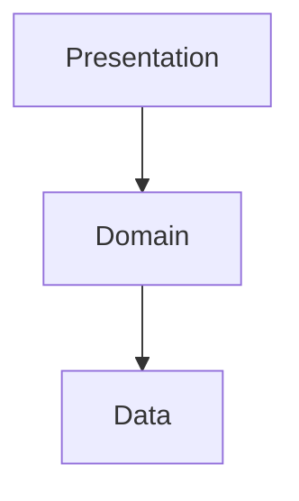
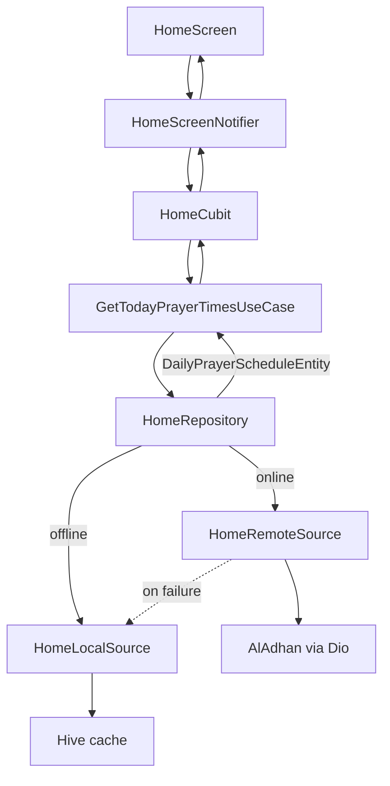
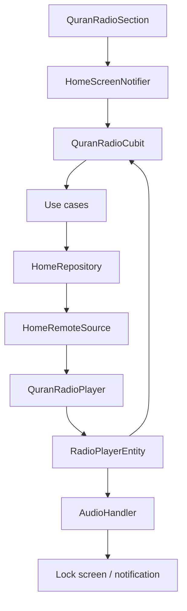
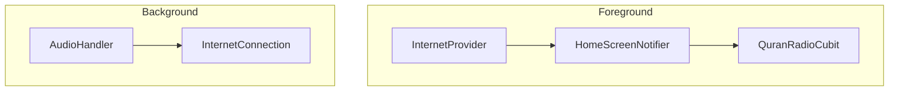

# Sakeenah · سكينة

<p align="center">
  <a href="https://github.com/Ammourie/Mobile/releases/latest">
    
  </a>
</p>

<p align="center">
  <a href="README.md"><strong>Overview</strong></a>
  &nbsp;·&nbsp;
  <a href="README.en.md"><strong>English</strong></a>
  &nbsp;·&nbsp;
  <strong>العربية</strong>
</p>

---

<a id="table-of-contents"></a>

## جدول المحتويات

انتقل مباشرة إلى:

- [عن التطبيق](#about)
- [Flutter و FVM](#flutter-fvm)
- [التثبيت](#install)
- [التحميل](#download)
- [التشغيل](#run)
- [بنية الـ TDD](#architecture)
- [قواعد Cursor](#cursor)
- [أهم الـ Packages](#packages)
- [الترجمة (Localization)](#localization)
- [الثيمات (Themes)](#themes)
- [التنقل (Routing)](#routing)
- [مواقيت الصلاة](#prayer-times)
- [راديو القرآن](#quran-radio)

---

<a id="about"></a>

## عن التطبيق

**سكينة (Sakeenah)** تطبيق Flutter بسيط وموثوق، مخصص للاستخدام الإسلامي اليومي، ويجمع بين ميزتين أساسيتين:

- **مواقيت الصلاة** — أوقات صلاة دقيقة مبنية على الموقع الجغرافي، مع إبراز الصلاة القادمة، ودعم التخزين المؤقت للعمل بدون اتصال بالإنترنت.
- **راديو القرآن** — بث مباشر للتلاوة، مع أزرار Play/Pause، تحكم بمستوى الصوت، تخطي، وإمكانية seek داخل الـ buffer، إضافة إلى **تشغيل في الخلفية (background playback)** مع عناصر تحكم في شاشة القفل والإشعارات.

يدعم التطبيق **اللغتين الإنجليزية والعربية (RTL)**، **الوضعين الفاتح والداكن**، وواجهة Material 3 نظيفة مبنية على Clean Architecture (data / domain / presentation).

| | |
|---|---|
| **Package name** | `com.ammourie.sakeenah` |
| **Version** | `1.0.0+1` |
| **Repository** | [github.com/Ammourie/Mobile](https://github.com/Ammourie/Mobile) |

---

<a id="flutter-fvm"></a>

## Flutter و FVM

يعتمد المشروع على **[FVM](https://fvm.app/)** لتثبيت **Flutter `3.44.0`** و**Dart `^3.10.0`** حتى يبني الجميع بنفس الإصدار على الأجهزة وفي الـ CI. راجع [`.fvmrc`](.fvmrc) و[`pubspec.yaml`](pubspec.yaml).

---

<a id="install"></a>

## التثبيت

**المتطلبات:** Git، [FVM](https://fvm.app/) + Flutter `3.44.0`، Android Studio (أو Xcode على macOS لـ iOS).

<div dir="ltr">

```bash
git clone https://github.com/Ammourie/Mobile.git
cd Mobile
fvm install && fvm use
fvm flutter pub get
fvm dart run build_runner build --delete-conflicting-outputs
fvm dart run intl_utils:generate
cd ios && pod install && cd ..   # iOS only
```

</div>

> أي تعديل native (manifest، plist، plugin جديد) يتطلب **full app restart** — الـ hot reload وحده لا يكفي.

---

<a id="download"></a>

## التحميل

يتم نشر ملفات APK الجاهزة على GitHub Releases.

<p align="center">
  <a href="https://github.com/Ammourie/Mobile/releases/latest">
    
  </a>
  <br />
  <strong><a href="https://github.com/Ammourie/Mobile/releases/latest">تحميل أحدث APK</a></strong>
</p>

| | |
|---|---|
| **All releases** | [github.com/Ammourie/Mobile/releases](https://github.com/Ammourie/Mobile/releases) |
| **Install on device** | `adb install path/to/app-release.apk` |

---

<a id="run"></a>

## التشغيل

<div dir="ltr">

```bash
fvm flutter run                  # debug
fvm flutter run --release      # release on device
fvm flutter build apk --release
```

</div>

---

<a id="architecture"></a>

## بنية الـ TDD لكل feature

**TDD Clean Architecture** — كل feature له `presentation → domain → data`. الواجهة تمر عبر **Cubit → use case → repository → datasource**؛ مواقيت الصلاة وراديو القرآن يشتركان في stack واحد تحت `lib/features/home/`.

<div dir="ltr">



</div>

الـ state: **Cubit + Freezed**، DI عبر **GetIt + Injectable**، الإعدادات العامة عبر **Provider**. بعد تعديل `@freezed` أو `@injectable` أو `.arb` شغّل codegen محلياً (راجع [`.cursor/rules/no-codegen.mdc`](.cursor/rules/no-codegen.mdc)).

---

<a id="cursor"></a>

## قواعد Cursor

اتفاقيات **Cursor AI** المشتركة للـ architecture والـ UI والـ codegen وإعداد الـ native packages موجودة في [`.cursor/rules/`](.cursor/rules/).

---

<a id="packages"></a>

## أهم الـ Packages

الاعتماديات الأساسية من [`pubspec.yaml`](pubspec.yaml):

- **Architecture:** `flutter_bloc`, `provider`, `get_it`, `injectable`, `freezed`, `dartz`
- **Networking:** `dio`, `internet_connection_checker_plus`
- **Prayer times / location:** `geolocator`, `geocoding`, `google_maps_flutter`, `permission_handler`
- **Storage:** `hive`, `shared_preferences`
- **Quran radio / background audio:** `flutter_soloud`, `audio_service`, `audio_session`
- **UI / i18n:** `flutter_screenutil`, `flutter_svg`, `animated_theme_switcher`, flutter_intl (`S.current`)

---

<a id="localization"></a>

## الترجمة (Localization)

**إنجليزية + عربية (RTL).** النصوص في [`lib/l10n/intl_en.arb`](lib/l10n/intl_en.arb) / [`intl_ar.arb`](lib/l10n/intl_ar.arb)؛ استخدم `S.current` في الـ widgets. [`LocalizationProvider`](lib/core/localization/localization_provider.dart) يحفظ اللغة ويعيد بناء `MaterialApp` بدون إعادة تشغيل التطبيق.

---

<a id="themes"></a>

## الثيمات (Themes)

**فاتح، داكن، و system** عبر Material 3 و[`ThemeModeProvider`](lib/core/providers/theme_mode_provider.dart). استخدم `Theme.of(context).colorScheme` / `context.appColors` — كل screen يجب أن يعمل في both themes.

---

<a id="routing"></a>

## التنقل (Routing)

**Named routes** مع typed screen params عبر [`NavigationRoute`](lib/core/navigation/route_generator.dart) و[`Nav`](lib/core/navigation/nav.dart). أضِف الشاشات الجديدة في `route_generator.dart` مع `routeName` وclass `*Param`.

---

<a id="prayer-times"></a>

## مواقيت الصلاة

مواقيت الصلاة اليومية على الشاشة الرئيسية، مبنية على الموقع الجغرافي، وتعمل عبر **[AlAdhan Prayer Times API v1](https://aladhan.com/prayer-times-api)**.

### ما يراه المستخدم

- الصلوات الخمس (الفجر إلى العشاء) الخاصة **باليوم الحالي**
- إبراز **الصلاة القادمة** مع عدّاد تنازلي
- الموقع عبر **GPS**، أو **اختيار من الخريطة**، أو **دولة/مدينة يدوياً**
- fallback للعمل بدون إنترنت عند وجود جدول محفوظ (cached) لنفس المكان

### شكل طلب الـ API

يستدعي التطبيق AlAdhan مع **تاريخ اليوم داخل مسار الـ URL** بصيغة (`DD-MM-YYYY`)، بما يطابق الـ API الرسمي:

<div dir="ltr">

```bash
curl 'https://api.aladhan.com/v1/timings/08-09-2025?latitude=51.5194682&longitude=-0.1360365&method=2'
```

</div>

| نمط الموقع | Path | Query params |
|------------|------|---------------|
| GPS | `timings/{date}` | `latitude`, `longitude`, `method` |
| مدينة يدوياً | `timingsByCity/{date}` | `city`, `country`, `method` |
| عنوان | `timingsByAddress/{date}` | `address`, `method` |

- **`{date}`** — يُبنى عبر [`GetTodayPrayerTimesParams.formatAladhanDate()`](lib/features/home/data/request/param/get_today_prayer_times_params.dart) بالاعتماد على تاريخ اليوم المحلي للجهاز.
- **`method=2`** — طريقة حساب ISNA (قابلة للتعديل عبر `aladhanCalculationMethod`).

المعاملات الاختيارية في AlAdhan (`school`, `tune`, `shafaq`, إلخ) مدعومة من الـ API لكنها غير مستخدمة في هذا الإصدار (v1).

### مسار التنفيذ

<div dir="ltr">



</div>

الملفات الأساسية:

| Layer | File |
|-------|------|
| الـ Params ومسار التاريخ | [`get_today_prayer_times_params.dart`](lib/features/home/data/request/param/get_today_prayer_times_params.dart) |
| جلب البيانات عن بعد | [`home_remote_datasource.dart`](lib/features/home/data/datasource/home_remote_datasource.dart) |
| تحليل الـ Model | [`daily_prayer_schedule_model.dart`](lib/features/home/data/request/model/daily_prayer_schedule_model.dart) |
| منطق الصلاة القادمة | [`prayer_times_utils.dart`](lib/features/home/domain/utils/prayer_times_utils.dart) |
| بطاقة الواجهة | [`prayer_times_card.dart`](lib/features/home/presentation/widgets/prayer_times_card.dart) |

### التعامل مع الرد (Response)

يُرجع AlAdhan استجابة على شكل `{ "code": 200, "status": "OK", "data": { "timings": {...}, "date": {...} } }`.

- يتحقق [`AlAdhanResponseValidator`](lib/core/net/response_validators/aladhan_response_validator.dart) من نجاح الطلب.
- يستخرج [`AlAdhanCreateModelInterceptor`](lib/core/net/create_model_interceptor/aladhan_create_model_interceptor.dart) محتوى `data`.
- تقوم [`DailyPrayerScheduleModel.fromAladhanData()`](lib/features/home/data/request/model/daily_prayer_schedule_model.dart) بتحويل أوقات الفجر إلى العشاء والتاريخ الميلادي إلى الشكل المستخدم في التطبيق.

عند النجاح، يُخزَّن الجدول وموقعه في Hive عبر `HomeScreenNotifier.cachePrayerTimesAndLocation()`. أما fallback العمل بدون إنترنت فيعيد استخدام آخر جدول محفوظ لنفس المكان (تطابق دقيق في حال الاختيار اليدوي، أو ضمن نطاق GPS محدد).

---

<a id="quran-radio"></a>

## راديو القرآن

بث مباشر لتلاوة القرآن الكريم مع مشغّل داخل التطبيق، وإمكانية seek داخل buffer محفوظ، وتشغيل حقيقي في الخلفية عبر `audio_service`.

### ما يحصل عليه المستخدم

- Play، Pause، Stop، التحكم بالصوت، وseek داخل الـ buffer المحفوظ من البث
- **تشغيل في الخلفية (background playback)** عند تصغير التطبيق أو قفل الشاشة
- عناصر تحكم في **إشعار الوسائط** على Android
- عناصر تحكم في **شاشة القفل / Control Center** على iOS
- حالة خطأ واضحة داخل نفس البطاقة مع أزرار retry / stop
- إعادة محاولة تلقائية بعد انقطاع مؤقت في الاتصال

### البنية العامة (High-level architecture)

<div dir="ltr">



</div>

### العناصر الأساسية

| العنصر | File | المسؤولية |
|--------|------|-----------|
| Bootstrap | [`lib/core/audio/quran_radio_audio_service.dart`](lib/core/audio/quran_radio_audio_service.dart) | يشغّل `AudioService`، يحمّل نصوص الإشعار المترجمة، ويوفّر الـ handler العام |
| Background handler | [`lib/features/home/data/datasource/quran_radio_audio_handler.dart`](lib/features/home/data/datasource/quran_radio_audio_handler.dart) | يحوّل حالة الـ player إلى media session/إشعار على مستوى النظام |
| محرك الصوت | [`lib/features/home/data/datasource/quran_radio_player.dart`](lib/features/home/data/datasource/quran_radio_player.dart) | استقبال البث عبر Dio + buffer محفوظ عبر SoLoud + seek + التحكم بالصوت |
| حالة الواجهة الأمامية | [`lib/features/home/presentation/state_m/cubit/quran_radio_cubit.dart`](lib/features/home/presentation/state_m/cubit/quran_radio_cubit.dart) | حالة الـ player الموجّهة للـ UI، آليات retry، والتعامل مع إعادة الاتصال |
| UI | [`lib/features/home/presentation/widgets/quran_radio_section.dart`](lib/features/home/presentation/widgets/quran_radio_section.dart) | بطاقة الـ hero، أزرار التحكم، شريط الـ buffer، وعرض الأخطاء |

### تسلسل بدء التشغيل

داخل [`lib/main.dart`](lib/main.dart)، يتم تهيئة صوت الخلفية قبل `runApp`:

1. `configureInjection()`
2. `LocalizationProvider().fetchLocale()`
3. `initQuranRadioAudioService()`
4. `AppConfig().initApp()`

هذا الترتيب مهم لأن نصوص الإشعار تعتمد على `S.current`، ولأن الـ handler يحتاج نسخة `QuranRadioPlayer` المشتركة من الـ DI.

### كيف يعمل التشغيل

يحافظ [`QuranRadioPlayer`](lib/features/home/data/datasource/quran_radio_player.dart) على محرك الراديو المباشر في مكان واحد:

- يستخدم **Dio** لفتح بث Icecast من `AppConstants.QURAN_RADIO_STREAM_URL`
- يمرر بايتات الصوت إلى **SoLoud** باستخدام `BufferingType.preserved`
- يخزّن buffer محلي في الذاكرة (RAM) حتى `QURAN_RADIO_MAX_BUFFER_DURATION_SECONDS`
- يدعم:
  - `play()` / `pause()`
  - `stop()` لإيقاف اتصال الـ HTTP والـ buffer والعودة إلى حالة idle
  - `retry()` لإعادة بناء البث من جديد
  - `seekBy()` و`seekTo()` داخل الـ buffer المحفوظ فقط
  - مستوى صوت بين `0` و`1`

هذا يعني أن شريط الـ seek **ليس** خطاً زمنياً كاملاً للبث، بل يمثّل فقط النافذة المحفوظة حالياً في الذاكرة.

### التشغيل في الخلفية والإشعار

يغلّف [`QuranRadioAudioHandler`](lib/features/home/data/datasource/quran_radio_audio_handler.dart) الـ player عبر `audio_service`:

- ينشر `MediaItem` لواجهة النظام
- يحوّل `RadioPlayerStatus` إلى `PlaybackState`
- يوفّر إجراءات في الإشعار / شاشة القفل:
  - رجوع `10` ثوانٍ
  - play / pause
  - تقديم `10` ثوانٍ
  - stop

تفاصيل Android:

- Foreground service عبر `AudioService`
- معرّف قناة الإشعار: `com.ammourie.sakeenah.quran_radio`
- أيقونة شريط الحالة الصغيرة: `ic_stat_name`
- أيقونات الأزرار: `ic_radio_play`, `ic_radio_pause`, `ic_radio_skip_back`, `ic_radio_skip_forward`, `ic_radio_stop`
- `androidStopForegroundOnPause: false` يُبقي الجلسة ظاهرة أثناء الإيقاف المؤقت
- الملف `android/app/src/main/res/raw/keep.xml` يحمي رسومات الإشعار من الحذف أثناء تصغير الـ release

تفاصيل iOS:

- `UIBackgroundModes -> audio` داخل [`ios/Runner/Info.plist`](ios/Runner/Info.plist)
- استخدام عناصر تحكم النظام القياسية في شاشة القفل / Control Center

### Audio focus، المقاطعات، وإعادة الاتصال

يستخدم التطبيق [`audio_session`](https://pub.dev/packages/audio_session) بملف تعريف الموسيقى (music profile):

- عند بدء مكالمة / مقاطعة -> pause
- عند انتهاء المقاطعة -> استئناف التشغيل إذا كان فعالاً قبلها

بالنسبة للاتصال بالإنترنت:

<div dir="ltr">



</div>

- عند انقطاع البث أثناء التشغيل، يعلّمه الـ handler لإعادة المحاولة تلقائياً بمحاولات `backoff` (`3` محاولات، بفاصل `2` ثانية بين كل محاولة)

### صورة الإشعار (Notification artwork)

يقوم [`lib/core/audio/quran_radio_notification_art.dart`](lib/core/audio/quran_radio_notification_art.dart) بنسخ شعار Flutter من الـ assets إلى مجلد دعم التطبيق، ثم يُرجع `Uri` لملف حقيقي.

هذا ضروري لأن إشعارات الوسائط على Android لا يمكنها قراءة مسار Flutter asset مباشرة من أجل `MediaItem.artUri`.

### التعامل مع الأخطاء

تستخدم تجربة راديو القرآن الحالية سطح خطأ **واحد** فقط داخل نفس البطاقة:

- تبقى `QuranRadioSection` والـ hero card ظاهرة
- يعرض `_RadioErrorPanel` الرسالة وزري retry وstop
- يحوّل `QuranRadioErrorMessage` أخطاء التشغيل/الاتصال الخام إلى نصوص مترجمة وواضحة للمستخدم
- الـ `QuranRadioErrorWidget` القديم المنفصل لم يعد مستخدماً

### ملخص الإعدادات الـ native

| المنصة | الإعداد المطلوب |
|--------|-------------------|
| Android | صلاحيات `WAKE_LOCK`، `FOREGROUND_SERVICE`، `FOREGROUND_SERVICE_MEDIA_PLAYBACK`، خدمة `AudioService`، `MediaButtonReceiver`، و`MainActivity : AudioServiceActivity` |
| iOS | تفعيل `audio` داخل `UIBackgroundModes` |

بعد أي تعديل على package native أو على manifest / plist، يجب عمل **full app restart** أو إعادة التثبيت. الـ hot reload وحده لا يكفي.

---

<p align="center">
  <sub>Sakeenah · سكينة — Prayer times & Quran Radio</sub>
</p>
