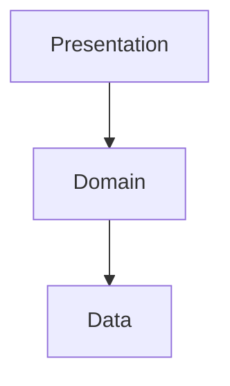
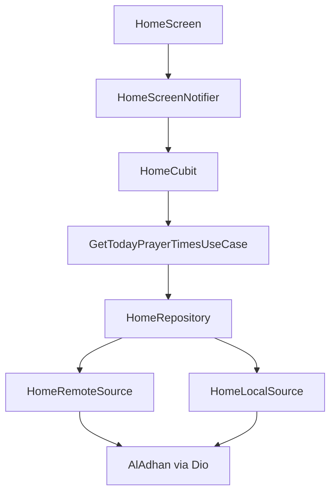
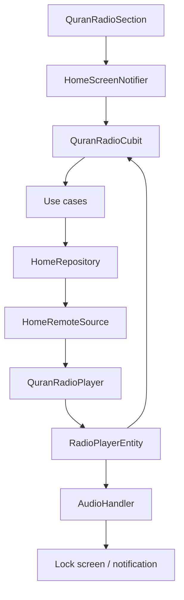
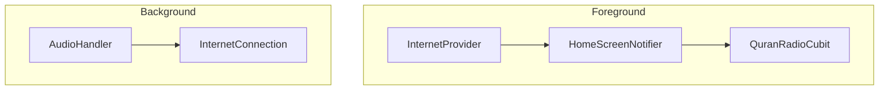

# Sakeenah

<p align="center">
  <a href="https://github.com/Ammourie/Mobile/releases/latest">
    
  </a>
</p>

<p align="center">
  <a href="README.md"><strong>Overview</strong></a>
  &nbsp;·&nbsp;
  <strong>English</strong>
  &nbsp;·&nbsp;
  <a href="README.ar.md"><strong>العربية</strong></a>
</p>

---

<a id="table-of-contents"></a>

## Table of contents

Jump to:

- [About](#about)
- [Flutter & FVM](#flutter-fvm)
- [Install](#install)
- [Download](#download)
- [Run](#run)
- [Architecture](#architecture)
- [Cursor rules](#cursor)
- [Packages](#packages)
- [Localization](#localization)
- [Themes](#themes)
- [Routing](#routing)
- [Prayer times](#prayer-times)
- [Quran radio](#quran-radio)

---

<a id="about"></a>

## About

**Sakeenah** is a simple, reliable Flutter mobile app for daily Islamic use. It combines:

- **Prayer times** — accurate, location-based salah times with next-prayer highlight and offline-friendly caching.
- **Quran Radio** — live recitation stream with play/pause, volume, skip, seek within the buffer, and **background playback** with lock-screen / notification controls.

The app supports **English and Arabic (RTL)**, **light and dark themes**, and a clean Material 3 interface built on Clean Architecture (data / domain / presentation).

| | |
|---|---|
| **Package name** | `com.ammourie.sakeenah` |
| **Version** | `1.0.0+1` |
| **Repository** | [github.com/Ammourie/Mobile](https://github.com/Ammourie/Mobile) |

---

<a id="flutter-fvm"></a>

## Flutter & FVM

Uses **[FVM](https://fvm.app/)** to pin **Flutter `3.44.0`** and **Dart `^3.10.0`** for consistent builds across machines and CI. See [`.fvmrc`](.fvmrc) and [`pubspec.yaml`](pubspec.yaml).

---

<a id="install"></a>

## Install

**Prerequisites:** Git, [FVM](https://fvm.app/) + Flutter `3.44.0`, Android Studio (or Xcode on macOS for iOS).

<div dir="ltr">

```bash
git clone https://github.com/Ammourie/Mobile.git
cd Mobile
fvm install && fvm use
fvm flutter pub get
fvm dart run build_runner build --delete-conflicting-outputs
fvm dart run intl_utils:generate
cd ios && pod install && cd ..   # iOS only
```

</div>

> Native changes (manifest, plist, new plugins) need a **full app restart** — hot reload is not enough.

---

<a id="download"></a>

## Download

Pre-built APKs are published on GitHub Releases.

<p align="center">
  <a href="https://github.com/Ammourie/Mobile/releases/latest">
    
  </a>
</p>

| | |
|---|---|
| **All releases** | [github.com/Ammourie/Mobile/releases](https://github.com/Ammourie/Mobile/releases) |
| **Install on device** | `adb install path/to/app-release.apk` |

---

<a id="run"></a>

## Run

<div dir="ltr">

```bash
fvm flutter run                  # debug
fvm flutter run --release      # release on device
fvm flutter build apk --release
```

</div>

---

<a id="architecture"></a>

## TDD feature structure

**TDD Clean Architecture** — each feature has `presentation → domain → data`. UI goes through **Cubit → use case → repository → datasource**; prayer times and Quran radio share one stack under `lib/features/home/`.

<div dir="ltr">



</div>

State: **Cubit + Freezed**, DI via **GetIt + Injectable**, app-wide settings via **Provider**. After `@freezed`, `@injectable`, or `.arb` edits, run codegen locally (see [`.cursor/rules/no-codegen.mdc`](.cursor/rules/no-codegen.mdc)).

---

<a id="cursor"></a>

## Cursor rules

Shared **Cursor AI** conventions for architecture, UI, codegen, and native package setup live in [`.cursor/rules/`](.cursor/rules/).

---

<a id="packages"></a>

## Key packages

Main dependencies from [`pubspec.yaml`](pubspec.yaml):

- **Architecture:** `flutter_bloc`, `provider`, `get_it`, `injectable`, `freezed`, `dartz`
- **Networking:** `dio`, `internet_connection_checker_plus`
- **Prayer times / location:** `geolocator`, `geocoding`, `google_maps_flutter`, `permission_handler`
- **Storage:** `hive`, `shared_preferences`
- **Quran radio / background audio:** `flutter_soloud`, `audio_service`, `audio_session`
- **UI / i18n:** `flutter_screenutil`, `flutter_svg`, `animated_theme_switcher`, flutter_intl (`S.current`)

---

<a id="localization"></a>

## Localization

**English + Arabic (RTL).** User-facing strings live in [`lib/l10n/intl_en.arb`](lib/l10n/intl_en.arb) / [`intl_ar.arb`](lib/l10n/intl_ar.arb); use `S.current` in widgets. [`LocalizationProvider`](lib/core/localization/localization_provider.dart) persists the chosen locale and rebuilds `MaterialApp` without an app restart.

---

<a id="themes"></a>

## Themes

**Light, dark, and system** modes via Material 3 and [`ThemeModeProvider`](lib/core/providers/theme_mode_provider.dart). Use `Theme.of(context).colorScheme` / `context.appColors` — every screen must work in both themes.

---

<a id="routing"></a>

## Routing

**Named routes** with typed screen params via [`NavigationRoute`](lib/core/navigation/route_generator.dart) and [`Nav`](lib/core/navigation/nav.dart). Add new screens in `route_generator.dart` with a `routeName` and `*Param` class.

---

<a id="prayer-times"></a>

## Prayer times

Location-based daily salah times on the home screen, powered by the **[AlAdhan Prayer Times API v1](https://aladhan.com/prayer-times-api)**.

### What the user sees

- Five daily prayers (Fajr → Isha) for **today**
- **Next prayer** highlight and countdown
- Location from **GPS**, **map pick**, or **manual country/city**
- Offline fallback when a cached schedule exists for the same place

### API request format

The app calls AlAdhan with **today’s date in the URL path** (`DD-MM-YYYY`), matching the official API:

<div dir="ltr">

```bash
curl 'https://api.aladhan.com/v1/timings/08-09-2025?latitude=51.5194682&longitude=-0.1360365&method=2'
```

</div>

| Location mode | Path | Query params |
|---------------|------|--------------|
| GPS | `timings/{date}` | `latitude`, `longitude`, `method` |
| Manual city | `timingsByCity/{date}` | `city`, `country`, `method` |
| Address | `timingsByAddress/{date}` | `address`, `method` |

- **`{date}`** — built by [`GetTodayPrayerTimesParams.formatAladhanDate()`](lib/features/home/data/request/param/get_today_prayer_times_params.dart) from the device’s local calendar day.
- **`method=2`** — ISNA calculation method (configurable via `aladhanCalculationMethod`).

Optional AlAdhan params (`school`, `tune`, `shafaq`, etc.) are supported by the API but not used in v1.

### Implementation flow

<div dir="ltr">



</div>

Key files:

| Layer | File |
|-------|------|
| Params & date path | [`get_today_prayer_times_params.dart`](lib/features/home/data/request/param/get_today_prayer_times_params.dart) |
| Remote fetch | [`home_remote_datasource.dart`](lib/features/home/data/datasource/home_remote_datasource.dart) |
| Model parsing | [`daily_prayer_schedule_model.dart`](lib/features/home/data/request/model/daily_prayer_schedule_model.dart) |
| Next prayer logic | [`prayer_times_utils.dart`](lib/features/home/domain/utils/prayer_times_utils.dart) |
| UI card | [`prayer_times_card.dart`](lib/features/home/presentation/widgets/prayer_times_card.dart) |

### Response handling

AlAdhan returns `{ "code": 200, "status": "OK", "data": { "timings": {...}, "date": {...} } }`.

- [`AlAdhanResponseValidator`](lib/core/net/response_validators/aladhan_response_validator.dart) checks success.
- [`AlAdhanCreateModelInterceptor`](lib/core/net/create_model_interceptor/aladhan_create_model_interceptor.dart) unwraps `data`.
- [`DailyPrayerScheduleModel.fromAladhanData()`](lib/features/home/data/request/model/daily_prayer_schedule_model.dart) maps Fajr–Isha and the gregorian date.

On success, the schedule and its location are cached in Hive via `HomeScreenNotifier.cachePrayerTimesAndLocation()`. Offline fallback now reuses the latest cached schedule for the same place (exact manual match, or GPS within the configured radius).

---

<a id="quran-radio"></a>

## Quran radio

Live Quran recitation with an in-app player, preserved buffer seeking, and true background playback through `audio_service`.

### What the user gets

- Play, pause, stop, volume, and seek within the preserved stream buffer
- **Background playback** when the app is minimized or the screen is locked
- Android **media notification** controls
- iOS **lock-screen / Control Center** media controls
- Friendly inline error state with retry / stop
- Auto-retry after temporary connectivity loss

### High-level architecture

<div dir="ltr">



</div>

### Core pieces

| Piece | File | Responsibility |
|-------|------|-----------------|
| Bootstrap | [`lib/core/audio/quran_radio_audio_service.dart`](lib/core/audio/quran_radio_audio_service.dart) | Starts `AudioService`, loads localized notification strings, exposes global handler |
| Background handler | [`lib/features/home/data/datasource/quran_radio_audio_handler.dart`](lib/features/home/data/datasource/quran_radio_audio_handler.dart) | Maps player state to system media session / notification |
| Audio engine | [`lib/features/home/data/datasource/quran_radio_player.dart`](lib/features/home/data/datasource/quran_radio_player.dart) | Dio stream ingest + SoLoud preserved buffer + seek + volume |
| Foreground state | [`lib/features/home/presentation/state_m/cubit/quran_radio_cubit.dart`](lib/features/home/presentation/state_m/cubit/quran_radio_cubit.dart) | UI-facing player state, retry hooks, reconnection handling |
| UI | [`lib/features/home/presentation/widgets/quran_radio_section.dart`](lib/features/home/presentation/widgets/quran_radio_section.dart) | Hero card, controls, buffer slider, inline errors |

### Startup sequence

In [`lib/main.dart`](lib/main.dart), background audio is initialized before `runApp`:

1. `configureInjection()`
2. `LocalizationProvider().fetchLocale()`
3. `initQuranRadioAudioService()`
4. `AppConfig().initApp()`

This order matters because notification labels use `S.current`, and the handler needs the shared `QuranRadioPlayer` from DI.

### How playback works

[`QuranRadioPlayer`](lib/features/home/data/datasource/quran_radio_player.dart) keeps the live radio engine in one place:

- Uses **Dio** to open the Icecast stream at `AppConstants.QURAN_RADIO_STREAM_URL`
- Feeds audio bytes into **SoLoud** with `BufferingType.preserved`
- Stores a local RAM buffer up to `QURAN_RADIO_MAX_BUFFER_DURATION_SECONDS`
- Supports:
  - `play()` / `pause()`
  - `stop()` to tear down HTTP + buffer and return to idle
  - `retry()` to rebuild the stream
  - `seekBy()` and `seekTo()` inside the preserved buffer only
  - volume `0..1`

This means the seek bar is **not** a full broadcast timeline. It is only the buffered window that already exists in memory.

### Background playback and notification

[`QuranRadioAudioHandler`](lib/features/home/data/datasource/quran_radio_audio_handler.dart) wraps the player with `audio_service`:

- Publishes a `MediaItem` for system UI
- Maps `RadioPlayerStatus` to `PlaybackState`
- Exposes notification / lock-screen actions:
  - rewind `10s`
  - play / pause
  - fast-forward `10s`
  - stop

Android details:

- Foreground service via `AudioService`
- Notification channel ID: `com.ammourie.sakeenah.quran_radio`
- Small status-bar icon: `ic_stat_name`
- Action icons: `ic_radio_play`, `ic_radio_pause`, `ic_radio_skip_back`, `ic_radio_skip_forward`, `ic_radio_stop`
- `androidStopForegroundOnPause: false` keeps the session visible while paused
- `android/app/src/main/res/raw/keep.xml` protects notification drawables from release shrinking

iOS details:

- `UIBackgroundModes -> audio` in [`ios/Runner/Info.plist`](ios/Runner/Info.plist)
- Uses standard lock-screen / Control Center transport controls

### Audio focus, interruptions, and reconnection

The app uses [`audio_session`](https://pub.dev/packages/audio_session) with the music profile:

- phone call / interruption begins -> pause
- interruption ends -> resume if playback was active before

For connectivity:

<div dir="ltr">



</div>
- if the stream drops while playing, the handler marks it for auto-retry and retries with backoff (`3` attempts, `2s` delay)

### Notification artwork

[`lib/core/audio/quran_radio_notification_art.dart`](lib/core/audio/quran_radio_notification_art.dart) copies the Flutter logo asset to the app support directory and returns a file `Uri`.

This is needed because Android media notifications cannot read a Flutter asset path directly for `MediaItem.artUri`.

### Error handling

The current Quran radio UX uses **one** error surface inside the same card:

- `QuranRadioSection` keeps the hero visible
- `_RadioErrorPanel` shows the message, retry, and stop
- `QuranRadioErrorMessage` maps raw playback / connectivity errors to friendly localized strings
- the old separate `QuranRadioErrorWidget` is no longer used

### Native setup summary

| Platform | Required setup |
|----------|-----------------|
| Android | `WAKE_LOCK`, `FOREGROUND_SERVICE`, `FOREGROUND_SERVICE_MEDIA_PLAYBACK`, `AudioService` service, `MediaButtonReceiver`, `MainActivity : AudioServiceActivity` |
| iOS | `UIBackgroundModes` includes `audio` |

After any native package or manifest / plist change, do a **full app restart** or reinstall. Hot reload is not enough.

---

<p align="center">
  <sub>Sakeenah · سكينة — Prayer times & Quran Radio</sub>
</p>
