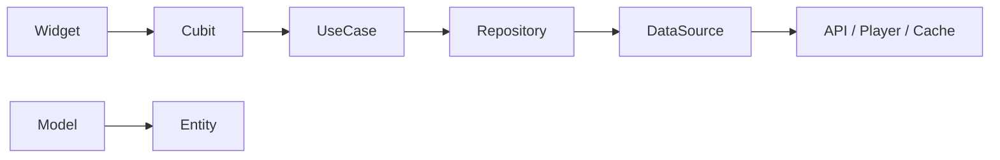
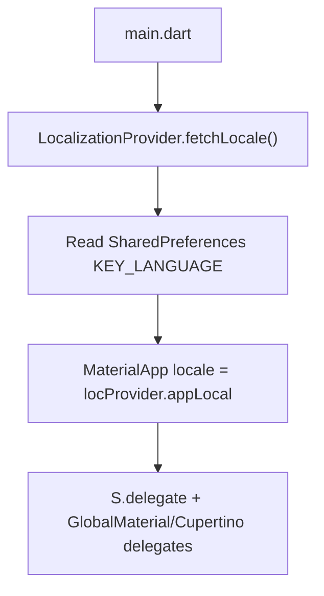
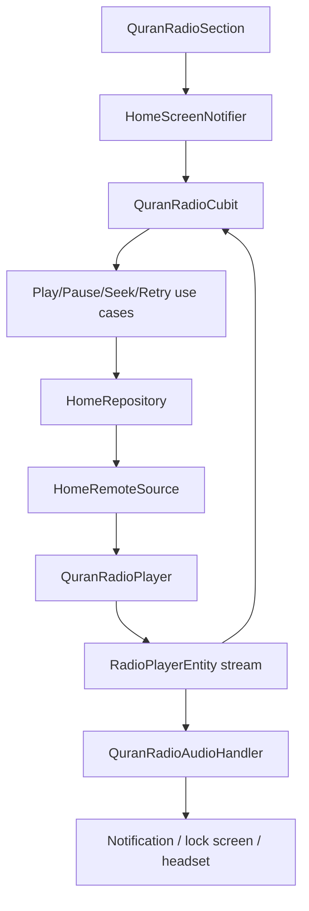
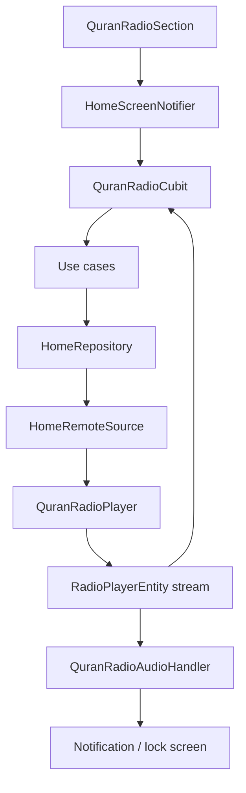

# Sakeenah · سكينة

<p align="center">
  <a href="https://github.com/Ammourie/Mobile/releases/latest">
    
  </a>
</p>

<p align="center">
  <strong>English</strong> · <a href="#table-of-contents-en">Contents</a> ·
  <strong>العربية</strong> · <a href="#table-of-contents-ar">المحتويات</a>
</p>

---

## Table of contents {#table-of-contents-en}

| Section | Link |
|---------|------|
| About the app | [About](#about-en) |
| Flutter & FVM | [Flutter & FVM](#flutter-fvm-en) |
| Installation | [Install](#install-en) |
| Download APK | [Download](#download-en) |
| Run the app | [Run](#run-en) |
| TDD feature structure | [Architecture](#architecture-en) |
| Cursor skills & rules | [Cursor reference](#cursor-en) |
| Key packages | [Packages](#packages-en) |
| Localization | [Localization](#localization-en) |
| Themes | [Themes](#themes-en) |
| Routing | [Routing](#routing-en) |
| Prayer times feature | [Prayer times](#prayer-times-en) |
| Quran radio & background playback | [Quran radio](#quran-radio-en) |
| Documentation phases | [Phases](#phases-en) |

---

## جدول المحتويات {#table-of-contents-ar}

| القسم | الرابط |
|-------|--------|
| عن التطبيق | [عن التطبيق](#about-ar) |
| Flutter و FVM | [Flutter و FVM](#flutter-fvm-ar) |
| التثبيت | [التثبيت](#install-ar) |
| تحميل APK | [التحميل](#download-ar) |
| تشغيل التطبيق | [التشغيل](#run-ar) |
| بنية TDD للميزات | [البنية](#architecture-ar) |
| مهارات وقواعد Cursor | [مرجع Cursor](#cursor-ar) |
| الحزم الرئيسية | [الحزم](#packages-ar) |
| الترجمة | [الترجمة](#localization-ar) |
| الموضوعات | [الموضوعات](#themes-ar) |
| التوجيه | [التوجيه](#routing-ar) |
| مواقيت الصلاة | [مواقيت الصلاة](#prayer-times-ar) |
| راديو القرآن والتشغيل بالخلفية | [راديو القرآن](#quran-radio-ar) |
| مراحل التوثيق | [المراحل](#phases-ar) |

---

## About {#about-en}

**Sakeenah** is a simple, reliable Flutter mobile app for daily Islamic use. It combines:

- **Prayer times** — accurate, location-based salah times with next-prayer highlight and offline-friendly caching.
- **Quran Radio** — live recitation stream with play/pause, volume, skip, seek within the buffer, and **background playback** with lock-screen / notification controls.

The app supports **English and Arabic (RTL)**, **light and dark themes**, and a clean Material 3 interface built on Clean Architecture (data / domain / presentation).

| | |
|---|---|
| **Package name** | `com.ammourie.sakeenah` |
| **Version** | `1.0.0+1` |
| **Repository** | [github.com/Ammourie/Mobile](https://github.com/Ammourie/Mobile) |

---

## عن التطبيق {#about-ar}

**سكينة (Sakeenah)** تطبيق Flutter بسيط وموثوق للاستخدام اليومي. يجمع بين:

- **مواقيت الصلاة** — أوقات صلاة دقيقة حسب الموقع مع تمييز الصلاة القادمة ودعم التخزين المؤقت للعمل دون اتصال.
- **راديو القرآن** — بث مباشر للتلاوة مع تشغيل/إيقاف مؤقت، التحكم بالصوت، التخطي، والتقديم ضمن الذاكرة المؤقتة، مع **تشغيل في الخلفية** وعناصر تحكم في شاشة القفل والإشعارات.

يدعم التطبيق **الإنجليزية والعربية (RTL)** و**الوضع الفاتح والداكن**، وواجهة Material 3 نظيفة مبنية على Clean Architecture (data / domain / presentation).

| | |
|---|---|
| **اسم الحزمة** | `com.ammourie.sakeenah` |
| **الإصدار** | `1.0.0+1` |
| **المستودع** | [github.com/Ammourie/Mobile](https://github.com/Ammourie/Mobile) |

---

## Flutter & FVM {#flutter-fvm-en}

This project uses **[FVM](https://fvm.app/)** (Flutter Version Management) so everyone builds with the same Flutter SDK.

| Tool | Version / note |
|------|----------------|
| **Flutter** | `3.44.0` (see [`.fvmrc`](.fvmrc)) |
| **Dart SDK** | `^3.10.0` (see [`pubspec.yaml`](pubspec.yaml)) |
| **Package manager** | Always use `fvm flutter` / `fvm dart` — not bare `flutter` |

**Why FVM?** Pinning the SDK avoids “works on my machine” issues when teammates or CI use a different Flutter version.

**Install FVM** (once per machine):

```bash
dart pub global activate fvm
```

Then in the project root:

```bash
fvm install 3.44.0
fvm use 3.44.0
```

---

## Flutter و FVM {#flutter-fvm-ar}

يستخدم هذا المشروع **[FVM](https://fvm.app/)** (إدارة إصدارات Flutter) لضمان بناء التطبيق بنفس إصدار Flutter لدى الجميع.

| الأداة | الإصدار / ملاحظة |
|--------|-------------------|
| **Flutter** | `3.44.0` (راجع [`.fvmrc`](.fvmrc)) |
| **Dart SDK** | `^3.10.0` (راجع [`pubspec.yaml`](pubspec.yaml)) |
| **مدير الحزم** | استخدم دائماً `fvm flutter` / `fvm dart` — وليس `flutter` مباشرة |

**لماذا FVM؟** تثبيت الإصدار يمنع مشاكل “يعمل عندي فقط” عندما يستخدم الزملاء أو CI إصدار Flutter مختلف.

**تثبيت FVM** (مرة واحدة على الجهاز):

```bash
dart pub global activate fvm
```

ثم من جذر المشروع:

```bash
fvm install 3.44.0
fvm use 3.44.0
```

---

## Install {#install-en}

### Prerequisites

- [Git](https://git-scm.com/)
- [FVM](https://fvm.app/documentation/getting-started/installation) + Flutter `3.44.0` (via `fvm install` above)
- **Android:** Android Studio, SDK, and a device or emulator
- **iOS (macOS only):** Xcode, CocoaPods

### Steps

```bash
# 1. Clone
git clone https://github.com/Ammourie/Mobile.git
cd Mobile

# 2. Flutter SDK (FVM)
fvm install
fvm use

# 3. Dependencies
fvm flutter pub get

# 4. Code generation (required after clone or model/DI changes)
fvm dart run build_runner build --delete-conflicting-outputs
fvm dart run intl_utils:generate

# 5. iOS only
cd ios && pod install && cd ..
```

> **Note:** Native changes (Android manifest, iOS plist, new plugins) require a **full app restart** — hot reload is not enough.

---

## التثبيت {#install-ar}

### المتطلبات

- [Git](https://git-scm.com/)
- [FVM](https://fvm.app/documentation/getting-started/installation) + Flutter `3.44.0` (عبر `fvm install` أعلاه)
- **Android:** Android Studio و SDK وجهاز أو محاكي
- **iOS (macOS فقط):** Xcode و CocoaPods

### الخطوات

```bash
# 1. استنساخ المستودع
git clone https://github.com/Ammourie/Mobile.git
cd Mobile

# 2. Flutter SDK (FVM)
fvm install
fvm use

# 3. الحزم
fvm flutter pub get

# 4. توليد الكود (مطلوب بعد الاستنساخ أو تغيير النماذج/DI)
fvm dart run build_runner build --delete-conflicting-outputs
fvm dart run intl_utils:generate

# 5. iOS فقط
cd ios && pod install && cd ..
```

> **ملاحظة:** التغييرات الأصلية (Android manifest، iOS plist، حزم جديدة) تتطلب **إعادة تشغيل كاملة للتطبيق** — إعادة التحميل السريع لا تكفي.

---

## Download {#download-en}

Pre-built APKs are published on GitHub Releases.

<p align="center">
  <a href="https://github.com/Ammourie/Mobile/releases/latest">
    
  </a>
</p>

| | |
|---|---|
| **All releases** | [github.com/Ammourie/Mobile/releases](https://github.com/Ammourie/Mobile/releases) |
| **Install on device** | `adb install path/to/app-release.apk` |

---

## التحميل {#download-ar}

ملفات APK الجاهزة تُنشر على GitHub Releases.

<p align="center">
  <a href="https://github.com/Ammourie/Mobile/releases/latest">
    
  </a>
</p>

| | |
|---|---|
| **كل الإصدارات** | [github.com/Ammourie/Mobile/releases](https://github.com/Ammourie/Mobile/releases) |
| **التثبيت على الجهاز** | `adb install path/to/app-release.apk` |

---

## Run {#run-en}

```bash
# List devices
fvm flutter devices

# Debug (default)
fvm flutter run

# Release mode on device
fvm flutter run --release

# Build release APK
fvm flutter build apk --release
# Output: build/app/outputs/flutter-apk/app-release.apk

# Build App Bundle (Play Store)
fvm flutter build appbundle --release
```

**Analyze & test:**

```bash
fvm flutter analyze
fvm flutter test
```

---

## التشغيل {#run-ar}

```bash
# عرض الأجهزة
fvm flutter devices

# وضع التطوير (افتراضي)
fvm flutter run

# وضع الإصدار على الجهاز
fvm flutter run --release

# بناء APK للإصدار
fvm flutter build apk --release
# المخرجات: build/app/outputs/flutter-apk/app-release.apk

# بناء App Bundle (متجر Google Play)
fvm flutter build appbundle --release
```

**التحليل والاختبار:**

```bash
fvm flutter analyze
fvm flutter test
```

---

## TDD feature structure {#architecture-en}

This project uses **TDD Clean Architecture** — three layers per feature, wired **top-down** when adding a capability:

```
presentation  →  domain  →  data
   (UI)         (rules)    (API / cache / engines)
```

### Layer flow



| Layer | Folder | Responsibility |
|-------|--------|----------------|
| **Presentation** | `presentation/` | Screens, widgets, **Cubit** + **Freezed state**, user events |
| **Domain** | `domain/` | **Entities**, **repository interfaces**, **use cases** (app rules) |
| **Data** | `data/` | **Models**, **params**, **datasources**, **repository impl** |

### Adding a new use case (order matters)

Follow this sequence — same as [`.cursor/skills/flutter-clean-architecture-usecase/SKILL.md`](.cursor/skills/flutter-clean-architecture-usecase/SKILL.md):

1. **Entity** — `domain/entity/xxx_entity.dart` (pure Dart, `BaseEntity`)
2. **Model** — `data/request/model/xxx_model.dart` (`BaseModel`, `fromMap` + `toEntity`, type validators)
3. **Params** — `data/request/param/xxx_params.dart` (if the call needs input)
4. **DataSource** — method on `IXxxRemoteDataSource` / implementation
5. **Repository** — method on `IXxxRepository` / `XxxRepository` (maps `Either<AppErrors, Entity>`)
6. **Use case** — `domain/usecase/xxx_usecase.dart` (`@injectable`, extends `UseCase`)
7. **Cubit** — call use case from cubit; emit Freezed state

### Per-feature folder layout

```
lib/features/<feature>/
├── data/
│   ├── datasource/       # remote/local sources, players, handlers
│   └── request/
│       ├── model/        # JSON → Model → Entity
│       └── param/        # request bodies / query params
├── domain/
│   ├── entity/
│   ├── repository/       # IRepository + Repository
│   └── usecase/
└── presentation/
    ├── screen/
    ├── widgets/
    └── state_m/
        └── cubit/        # Cubit + freezed state (part files)
```

### Home feature convention

Prayer times and Quran radio share **one** repository stack under `lib/features/home/` (no separate `quran_radio` module). See [`.cursor/rules/home-single-layers.mdc`](.cursor/rules/home-single-layers.mdc).

```dart
// ✅ UI → cubit → use case → repository → datasource
quranRadioCubit.playRadio();

// ❌ Widget calling player/API directly
await quranRadioPlayer.play();
```

### State management

- **Cubit + Freezed** union states (`initial`, `loading`, `loaded`, `error`) — see [`.cursor/rules/freezed-cubit-states.mdc`](.cursor/rules/freezed-cubit-states.mdc)
- **GetIt + Injectable** for DI (`lib/di/`)
- **Provider** for app-wide notifiers (theme, locale, connectivity)

### Code generation

After changing `@freezed`, `@injectable`, or `.arb` files, run locally:

```bash
fvm dart run build_runner build --delete-conflicting-outputs
fvm dart run intl_utils:generate
```

Agents must **not** run codegen — see [`.cursor/rules/no-codegen.mdc`](.cursor/rules/no-codegen.mdc).

---

## بنية TDD للميزات {#architecture-ar}

يستخدم المشروع **TDD Clean Architecture** — ثلاث طبقات لكل ميزة، يتم ربطها **من الأعلى للأسفل** عند إضافة قدرة جديدة:

```
presentation  →  domain  →  data
   (الواجهة)      (القواعد)   (API / التخزين / المحركات)
```

### تدفق الطبقات

| الطبقة | المجلد | المسؤولية |
|--------|--------|-----------|
| **Presentation** | `presentation/` | الشاشات، الودجات، **Cubit** + **حالة Freezed**، أحداث المستخدم |
| **Domain** | `domain/` | **Entities**، **واجهات المستودع**، **Use cases** (قواعد التطبيق) |
| **Data** | `data/` | **Models**، **params**، **datasources**، **تنفيذ المستودع** |

### إضافة use case جديد (الترتيب مهم)

اتبع هذا التسلسل — كما في [`.cursor/skills/flutter-clean-architecture-usecase/SKILL.md`](.cursor/skills/flutter-clean-architecture-usecase/SKILL.md):

1. **Entity** — `domain/entity/xxx_entity.dart`
2. **Model** — `data/request/model/xxx_model.dart` (`fromMap` + `toEntity`)
3. **Params** — `data/request/param/xxx_params.dart` (إن وُجدت مدخلات)
4. **DataSource** — دالة على `IXxxRemoteDataSource` / التنفيذ
5. **Repository** — دالة على `IXxxRepository` / `XxxRepository`
6. **Use case** — `domain/usecase/xxx_usecase.dart`
7. **Cubit** — استدعاء use case وإصدار حالة Freezed

### هيكل مجلد الميزة

```
lib/features/<feature>/
├── data/          # datasource + models + params
├── domain/        # entities + repository + use cases
└── presentation/  # screens + widgets + cubits
```

### اتفاقية ميزة Home

مواقيت الصلاة وراديو القرآن يشاركان **مستودعاً واحداً** تحت `lib/features/home/` — راجع [`.cursor/rules/home-single-layers.mdc`](.cursor/rules/home-single-layers.mdc).

### إدارة الحالة

- **Cubit + Freezed** — [`.cursor/rules/freezed-cubit-states.mdc`](.cursor/rules/freezed-cubit-states.mdc)
- **GetIt + Injectable** — `lib/di/`
- **Provider** — للموضوع، اللغة، الاتصال

### توليد الكود

```bash
fvm dart run build_runner build --delete-conflicting-outputs
fvm dart run intl_utils:generate
```

الوكلاء **لا يشغّلون** codegen — [`.cursor/rules/no-codegen.mdc`](.cursor/rules/no-codegen.mdc).

---

## Cursor skills & rules {#cursor-en}

The repo ships **Cursor AI** configuration under [`.cursor/`](.cursor/) so humans and agents follow the same conventions.

### Skills (`.cursor/skills/`)

Step-by-step workflows — read when doing that kind of work:

| Skill | Path | When to use |
|-------|------|-------------|
| **Clean Architecture / use case** | [`flutter-clean-architecture-usecase/SKILL.md`](.cursor/skills/flutter-clean-architecture-usecase/SKILL.md) | New endpoint, entity, repository method, use case, cubit wiring |
| **UI conventions** | [`flutter-ui-conventions/SKILL.md`](.cursor/skills/flutter-ui-conventions/SKILL.md) | Screens, widgets, ScreenUtil sizing, loading states |
| **Localized strings** | [`dart-localized-strings/SKILL.md`](.cursor/skills/dart-localized-strings/SKILL.md) | Any user-facing text → `S.current` + `.arb` keys |
| **Design guidelines** | [`design-guidelines/SKILL.md`](.cursor/skills/design-guidelines/SKILL.md) | Material 3 polish, dual-theme, Lucide icons, surfaces |

### Rules (`.cursor/rules/`)

Always-on or glob-scoped constraints for the agent:

| Rule | File | Summary |
|------|------|---------|
| Home single layers | [`home-single-layers.mdc`](.cursor/rules/home-single-layers.mdc) | One repo/datasource for home; no parallel `quran_radio` module |
| Freezed cubit states | [`freezed-cubit-states.mdc`](.cursor/rules/freezed-cubit-states.mdc) | Union states via `@freezed`, not hand-written sealed classes |
| No codegen | [`no-codegen.mdc`](.cursor/rules/no-codegen.mdc) | Never run or edit generated files |
| Dual-theme UI | [`dual-theme-ui.mdc`](.cursor/rules/dual-theme-ui.mdc) | Light + dark; use `ColorScheme` / `context.appColors` |
| Curved app bar | [`curved-app-bar.mdc`](.cursor/rules/curved-app-bar.mdc) | `CurvedAppBarLayout`, not raw `Scaffold.appBar` |
| App wallpaper | [`app-wallpaper.mdc`](.cursor/rules/app-wallpaper.mdc) | Shared circles/grid canvas on every screen |
| ScreenUtil design size | [`screenutil-design-size.mdc`](.cursor/rules/screenutil-design-size.mdc) | Single canvas via `AppConfig.screenUtilDesignSize()` |
| Lucide SVG icons | [`lucide-svg-icons.mdc`](.cursor/rules/lucide-svg-icons.mdc) | New icons from Lucide static package |
| Pub.dev platform setup | [`pubdev-platform-setup.mdc`](.cursor/rules/pubdev-platform-setup.mdc) | Native Android/iOS config when adding packages |
| Notifier owns loading | [`notifier-owns-data-loading.mdc`](.cursor/rules/notifier-owns-data-loading.mdc) | Cubits/notifiers load data; widgets display only |
| Context select builder | [`context-select-builder.mdc`](.cursor/rules/context-select-builder.mdc) | `context.select` inside `Builder` / provider scope |

> **Tip:** In Cursor, `@` mention a rule or skill file to attach it to the chat.

---

## مهارات وقواعد Cursor {#cursor-ar}

يحتوي المستودع على إعدادات **Cursor AI** في [`.cursor/`](.cursor/) ليتبع المطوّرون والوكلاء نفس الاتفاقيات.

### المهارات (`.cursor/skills/`)

| المهارة | المسار | متى تُستخدم |
|---------|--------|-------------|
| **Clean Architecture / use case** | [`flutter-clean-architecture-usecase/SKILL.md`](.cursor/skills/flutter-clean-architecture-usecase/SKILL.md) | endpoint جديد، entity، repository، use case، cubit |
| **اتفاقيات الواجهة** | [`flutter-ui-conventions/SKILL.md`](.cursor/skills/flutter-ui-conventions/SKILL.md) | شاشات، ودجات، ScreenUtil، حالات التحميل |
| **النصوص المترجمة** | [`dart-localized-strings/SKILL.md`](.cursor/skills/dart-localized-strings/SKILL.md) | أي نص للمستخدم → `S.current` + `.arb` |
| **إرشادات التصميم** | [`design-guidelines/SKILL.md`](.cursor/skills/design-guidelines/SKILL.md) | Material 3، الوضعين، Lucide، الطبقات |

### القواعد (`.cursor/rules/`)

| القاعدة | الملف | ملخص |
|---------|-------|------|
| طبقة Home واحدة | [`home-single-layers.mdc`](.cursor/rules/home-single-layers.mdc) | مستودع واحد؛ لا وحدة `quran_radio` منفصلة |
| حالات Freezed | [`freezed-cubit-states.mdc`](.cursor/rules/freezed-cubit-states.mdc) | `@freezed` للحالات |
| بدون codegen | [`no-codegen.mdc`](.cursor/rules/no-codegen.mdc) | لا تشغيل/تعديل ملفات مُولَّدة |
| واجهة ثنائية الموضوع | [`dual-theme-ui.mdc`](.cursor/rules/dual-theme-ui.mdc) | فاتح + داكن |
| شريط علوي منحني | [`curved-app-bar.mdc`](.cursor/rules/curved-app-bar.mdc) | `CurvedAppBarLayout` |
| خلفية التطبيق | [`app-wallpaper.mdc`](.cursor/rules/app-wallpaper.mdc) | الدوائر والشبكة |
| حجم ScreenUtil | [`screenutil-design-size.mdc`](.cursor/rules/screenutil-design-size.mdc) | `AppConfig.screenUtilDesignSize()` |
| أيقونات Lucide | [`lucide-svg-icons.mdc`](.cursor/rules/lucide-svg-icons.mdc) | SVG من Lucide |
| إعداد حزم pub.dev | [`pubdev-platform-setup.mdc`](.cursor/rules/pubdev-platform-setup.mdc) | إعداد Android/iOS |
| Notifier يحمّل البيانات | [`notifier-owns-data-loading.mdc`](.cursor/rules/notifier-owns-data-loading.mdc) | Cubit يحمّل؛ الودجت يعرض |
| context.select | [`context-select-builder.mdc`](.cursor/rules/context-select-builder.mdc) | داخل `Builder` |

> **نصيحة:** في Cursor، اذكر `@` مع مسار القاعدة أو المهارة لإرفاقها بالمحادثة.

---

## Key packages {#packages-en}

Main dependencies from [`pubspec.yaml`](pubspec.yaml). Versions match the project lockfile at time of writing.

### Architecture & state

| Package | Version | Role in Sakeenah |
|---------|---------|------------------|
| [`flutter_bloc`](https://pub.dev/packages/flutter_bloc) | `9.1.1` | **Cubits** for feature state (`HomeCubit`, `QuranRadioCubit`); emits Freezed union states |
| [`provider`](https://pub.dev/packages/provider) | `6.1.5+1` | App-wide notifiers: theme, locale, connectivity, screen-level providers |
| [`get_it`](https://pub.dev/packages/get_it) | `9.2.1` | Service locator — resolves repositories, use cases, players |
| [`injectable`](https://pub.dev/packages/injectable) | `2.7.1+4` | DI annotations; generates `service_locator.config.dart` |
| [`freezed`](https://pub.dev/packages/freezed) + [`freezed_annotation`](https://pub.dev/packages/freezed_annotation) | `3.1.0` | Immutable union states for cubits (`HomeState`, `QuranRadioState`) |
| [`dartz`](https://pub.dev/packages/dartz) | `0.10.1` | `Either<AppErrors, T>` in repositories and use cases |
| [`equatable`](https://pub.dev/packages/equatable) | `2.0.8` | Value equality for entities and params |

### Networking & connectivity

| Package | Version | Role in Sakeenah |
|---------|---------|------------------|
| [`dio`](https://pub.dev/packages/dio) | `5.9.2` | HTTP client for **AlAdhan** prayer API, **CountriesNow**, and **Quran radio** Icecast stream |
| [`pretty_dio_logger`](https://pub.dev/packages/pretty_dio_logger) | `1.4.0` | Debug logging interceptor for Dio (development) |
| [`internet_connection_checker_plus`](https://pub.dev/packages/internet_connection_checker_plus) | `3.1.1` | Real internet reachability; drives offline banner and radio auto-retry |

### Prayer times & location

| Package | Version | Role in Sakeenah |
|---------|---------|------------------|
| [`geolocator`](https://pub.dev/packages/geolocator) | `14.0.2` | GPS coordinates for prayer times |
| [`geocoding`](https://pub.dev/packages/geocoding) | `5.0.0` | Reverse geocoding for map/manual location labels |
| [`google_maps_flutter`](https://pub.dev/packages/google_maps_flutter) | `2.17.1` | Map location picker with theme-aware map styles |
| [`permission_handler`](https://pub.dev/packages/permission_handler) | `12.0.2` | Location permission requests and settings flow |

### Storage & cache

| Package | Version | Role in Sakeenah |
|---------|---------|------------------|
| [`hive`](https://pub.dev/packages/hive) + [`hive_flutter`](https://pub.dev/packages/hive_flutter) | `2.2.3` / `1.1.0` | Local cache: prayer schedules, countries/cities session, geocoding |
| [`shared_preferences`](https://pub.dev/packages/shared_preferences) | `2.5.5` | Lightweight key-value prefs (onboarding, settings) |
| [`path_provider`](https://pub.dev/packages/path_provider) | `2.1.5` | App support directory for notification artwork cache |

### Quran radio & background audio

| Package | Version | Role in Sakeenah |
|---------|---------|------------------|
| [`flutter_soloud`](https://pub.dev/packages/flutter_soloud) | `4.1.7` | **Audio engine** — live stream ingest, preserved RAM buffer, seek ±10s, volume |
| [`audio_service`](https://pub.dev/packages/audio_service) | `0.18.19` | **Foreground service**, media notification, lock-screen / headset controls |
| [`audio_session`](https://pub.dev/packages/audio_session) | `0.2.4` | OS audio focus, interruptions (calls), music session profile |

> Native setup required for audio packages — see [`docs/quran_radio_background_playback.md`](docs/quran_radio_background_playback.md) and [`.cursor/rules/pubdev-platform-setup.mdc`](.cursor/rules/pubdev-platform-setup.mdc).

### UI, theme & localization

| Package | Version | Role in Sakeenah |
|---------|---------|------------------|
| [`flutter_screenutil`](https://pub.dev/packages/flutter_screenutil) | `5.9.3` | Responsive sizing (`.w`, `.h`, `.sp`, `.r`) against design canvas |
| [`flutter_svg`](https://pub.dev/packages/flutter_svg) | `2.3.0` | Lucide SVG icons in widgets |
| [`google_fonts`](https://pub.dev/packages/google_fonts) | `8.1.0` | Typography (Cairo, etc.) |
| [`animated_theme_switcher`](https://pub.dev/packages/animated_theme_switcher) | `2.0.10` | Animated light / dark / system theme transitions |
| [`skeletonizer`](https://pub.dev/packages/skeletonizer) | `2.1.3` | Skeleton loading placeholders |
| [`flutter_animate`](https://pub.dev/packages/flutter_animate) | `4.5.2` | Motion / entrance animations |
| [`cached_network_image`](https://pub.dev/packages/cached_network_image) | `3.4.1` | Cached remote images where used |
| **flutter_intl** (config) | — | Generates `S` class from `lib/l10n/intl_en.arb` / `intl_ar.arb` |

### Dev & codegen

| Package | Version | Role |
|---------|---------|------|
| [`build_runner`](https://pub.dev/packages/build_runner) | `2.5.4` | Runs code generators |
| [`injectable_generator`](https://pub.dev/packages/injectable_generator) | `2.7.0` | DI registration codegen |
| [`json_serializable`](https://pub.dev/packages/json_serializable) | `6.9.5` | JSON helpers (with Freezed where needed) |
| [`flutter_lints`](https://pub.dev/packages/flutter_lints) | `6.0.0` | Analyzer lint rules |
| [`flutter_native_splash`](https://pub.dev/packages/flutter_native_splash) | `2.4.8` | Native splash screens |
| [`flutter_launcher_icons`](https://pub.dev/packages/flutter_launcher_icons) | `0.14.4` | App launcher icons |

---

## الحزم الرئيسية {#packages-ar}

الاعتماديات الأساسية من [`pubspec.yaml`](pubspec.yaml).

### البنية وإدارة الحالة

| الحزمة | الإصدار | الدور في سكينة |
|--------|---------|----------------|
| [`flutter_bloc`](https://pub.dev/packages/flutter_bloc) | `9.1.1` | **Cubits** لحالة الميزات (`HomeCubit`, `QuranRadioCubit`) |
| [`provider`](https://pub.dev/packages/provider) | `6.1.5+1` | مزوّدو التطبيق: الموضوع، اللغة، الاتصال |
| [`get_it`](https://pub.dev/packages/get_it) | `9.2.1` | محدد موقع الخدمات (DI) |
| [`injectable`](https://pub.dev/packages/injectable) | `2.7.1+4` | تعليقات DI وتوليد `service_locator.config.dart` |
| [`freezed`](https://pub.dev/packages/freezed) | `3.1.0` | حالات union غير قابلة للتغيير للـ cubits |
| [`dartz`](https://pub.dev/packages/dartz) | `0.10.1` | `Either<AppErrors, T>` في المستودعات |
| [`equatable`](https://pub.dev/packages/equatable) | `2.0.8` | مساواة الكيانات والمعاملات |

### الشبكة والاتصال

| الحزمة | الإصدار | الدور |
|--------|---------|-------|
| [`dio`](https://pub.dev/packages/dio) | `5.9.2` | HTTP لـ **AlAdhan** و**CountriesNow** وبث **راديو القرآن** |
| [`pretty_dio_logger`](https://pub.dev/packages/pretty_dio_logger) | `1.4.0` | سجلات Dio في التطوير |
| [`internet_connection_checker_plus`](https://pub.dev/packages/internet_connection_checker_plus) | `3.1.1` | فحص الإنترنت؛ شريط offline وإعادة تشغيل الراديو |

### مواقيت الصلاة والموقع

| الحزمة | الإصدار | الدور |
|--------|---------|-------|
| [`geolocator`](https://pub.dev/packages/geolocator) | `14.0.2` | إحداثيات GPS |
| [`geocoding`](https://pub.dev/packages/geocoding) | `5.0.0` | تحويل الإحداثيات إلى عنوان |
| [`google_maps_flutter`](https://pub.dev/packages/google_maps_flutter) | `2.17.1` | اختيار الموقع على الخريطة |
| [`permission_handler`](https://pub.dev/packages/permission_handler) | `12.0.2` | أذونات الموقع |

### التخزين والذاكرة المؤقتة

| الحزمة | الإصدار | الدور |
|--------|---------|-------|
| [`hive`](https://pub.dev/packages/hive) / [`hive_flutter`](https://pub.dev/packages/hive_flutter) | `2.2.3` / `1.1.0` | تخزين مواقيت الصلاة والدول/المدن |
| [`shared_preferences`](https://pub.dev/packages/shared_preferences) | `2.5.5` | إعدادات خفيفة |
| [`path_provider`](https://pub.dev/packages/path_provider) | `2.1.5` | مسار ملفات artwork للإشعار |

### راديو القرآن والصوت في الخلفية

| الحزمة | الإصدار | الدور |
|--------|---------|-------|
| [`flutter_soloud`](https://pub.dev/packages/flutter_soloud) | `4.1.7` | **محرك الصوت** — بث مباشر، buffer، seek، صوت |
| [`audio_service`](https://pub.dev/packages/audio_service) | `0.18.19` | **خدمة أمامية**، إشعار الوسائط، شاشة القفل |
| [`audio_session`](https://pub.dev/packages/audio_session) | `0.2.4` | تركيز الصوت ومقاطعات المكالمات |

> إعداد native مطلوب — [`docs/quran_radio_background_playback.md`](docs/quran_radio_background_playback.md)

### الواجهة والترجمة

| الحزمة | الإصدار | الدور |
|--------|---------|-------|
| [`flutter_screenutil`](https://pub.dev/packages/flutter_screenutil) | `5.9.3` | أحجام متجاوبة |
| [`flutter_svg`](https://pub.dev/packages/flutter_svg) | `2.3.0` | أيقونات Lucide |
| [`google_fonts`](https://pub.dev/packages/google_fonts) | `8.1.0` | الخطوط |
| [`animated_theme_switcher`](https://pub.dev/packages/animated_theme_switcher) | `2.0.10` | تبديل الموضوع |
| [`skeletonizer`](https://pub.dev/packages/skeletonizer) | `2.1.3` | تحميل هيكلي |
| **flutter_intl** | — | `S.current` من ملفات `.arb` |

### التطوير وتوليد الكود

| الحزمة | الإصدار | الدور |
|--------|---------|-------|
| [`build_runner`](https://pub.dev/packages/build_runner) | `2.5.4` | تشغيل المولّدات |
| [`injectable_generator`](https://pub.dev/packages/injectable_generator) | `2.7.0` | توليد DI |
| [`json_serializable`](https://pub.dev/packages/json_serializable) | `6.9.5` | JSON |
| [`flutter_lints`](https://pub.dev/packages/flutter_lints) | `6.0.0` | قواعد المحلل |

---

## Localization {#localization-en}

Sakeenah supports **English** and **Arabic** with full **RTL** layout when Arabic is active.

### Stack

| Piece | Location | Role |
|-------|----------|------|
| **Source strings** | [`lib/l10n/intl_en.arb`](lib/l10n/intl_en.arb), [`lib/l10n/intl_ar.arb`](lib/l10n/intl_ar.arb) | Add keys here (camelCase) |
| **Generated API** | [`lib/generated/l10n.dart`](lib/generated/l10n.dart) | `S.current.myKey` — do not edit by hand |
| **Generator** | `flutter_intl` in [`pubspec.yaml`](pubspec.yaml) | Class name `S`; runs on save / manually |
| **Runtime provider** | [`LocalizationProvider`](lib/core/localization/localization_provider.dart) | Singleton `ChangeNotifier`; holds `Locale`, persists choice |
| **Skill** | [`.cursor/skills/dart-localized-strings/SKILL.md`](.cursor/skills/dart-localized-strings/SKILL.md) | All user-facing text → `S.current` |

### Startup flow



1. **`main.dart`** — `await LocalizationProvider().fetchLocale()` before `runApp` (and before `initQuranRadioAudioService()` so notification strings load).
2. **`App`** — `Consumer<LocalizationProvider>` rebuilds `MaterialApp` when locale changes.
3. **`localeResolutionCallback`** — on **first install only**, picks device language if supported, else English.

### Changing language at runtime

1. User opens **Language** screen (drawer or first-start onboarding).
2. [`LanguageScreenNotifier.confirm()`](lib/core/ui/screens/language_screen_notifier.dart) calls `LocalizationProvider.changeLanguage(Locale, context)`.
3. Provider saves `KEY_LANGUAGE` to `SharedPreferences` and `notifyListeners()`.
4. `MaterialApp` rebuilds with new `locale` — **no app restart** (RTL updates automatically).

```dart
// In widgets — never hardcode UI strings
Text(S.current.homePage)

// After adding a key to .arb files, regenerate:
// fvm dart run intl_utils:generate
```

### RTL

- Arabic locale (`ar`) triggers RTL via Flutter’s localization delegates.
- Directional widgets use `AlignmentDirectional`, `EdgeInsetsDirectional`, and `Start`/`End` where needed.
- Some controls (e.g. volume slider) wrap with `Directionality(textDirection: TextDirection.ltr)` when rotation must stay fixed.

### Adding a new string

1. Add the key to **`intl_en.arb`** and **`intl_ar.arb`**.
2. Run **`fvm dart run intl_utils:generate`** (or save if your IDE auto-generates).
3. Use **`S.current.yourKey`** in code.

---

## Themes {#themes-en}

Light, dark, and **system** theme with live preview and animated switching.

### Stack

| Piece | Location | Role |
|-------|----------|------|
| **Color schemes** | [`app_color_schemes.dart`](lib/core/theme/app_color_schemes.dart) | Material 3 `ColorScheme` (jade brand seed) |
| **Semantic aliases** | [`custom_theme_colors.dart`](lib/core/theme/custom_theme_colors.dart) | `context.appColors` (ink, card, muted, …) |
| **ThemeData** | [`themes_data.dart`](lib/core/theme/themes_data.dart) | `ThemesData.lightTheme` / `darkTheme` |
| **Text styles** | [`text_theme_styles.dart`](lib/core/theme/text_theme_styles.dart) | Shared typography — no inline `TextStyle` |
| **Provider** | [`ThemeModeProvider`](lib/core/providers/theme_mode_provider.dart) | `ThemeMode` + persistence + animated switch |
| **Persistence** | [`LocalStorage`](lib/core/common/local_storage.dart) | `getThemeMode` / `persistThemeMode` |

### Wiring in `App`

```dart
ThemeProvider(                          // animated_theme_switcher
  initTheme: AppConfig().resolveThemeDataForMode(themeProvider.themeMode),
  child: MaterialApp(
    theme: ThemesData.lightTheme,
    darkTheme: ThemesData.darkTheme,
    themeMode: themeProvider.themeMode, // light | dark | system
    ...
  ),
)
```

- **`ThemeModeProvider.load()`** — read saved mode on startup (default **system**).
- **`setThemeMode(mode, context: …)`** — persist, notify, optionally animate via `ThemeSwitcher.of(context).changeTheme(...)`.
- **`didChangePlatformBrightness`** — when mode is `system`, OS theme changes trigger rebuild.

### Changing theme at runtime

1. **Theme screen** (drawer or first-start after language) — [`ThemeScreenNotifier`](lib/core/ui/screens/theme_screen_notifier.dart).
2. User picks light / dark / system → `ThemeModeProvider.setThemeMode`.
3. UI updates immediately; preference survives restarts.

### UI rules (dual-theme)

- Use **`Theme.of(context).colorScheme`** and **`context.appColors`** — not hardcoded light-only hex.
- Every screen must work in **both** themes — see [`.cursor/rules/dual-theme-ui.mdc`](.cursor/rules/dual-theme-ui.mdc).

### First-start onboarding

[`App._resolveInitialScreen()`](lib/app.dart):

1. Language not chosen → `LanguageScreen`
2. Theme not chosen → `ThemeScreen`
3. Else → `SplashScreen` → home

---

## Routing {#routing-en}

Named routes with typed screen parameters and custom transitions.

### Stack

| Piece | Location | Role |
|-------|----------|------|
| **Navigator key** | [`NavigationService`](lib/core/navigation/navigation_service.dart) | `@lazySingleton` `GlobalKey<NavigatorState>` via GetIt |
| **Route table** | [`NavigationRoute.generateRoute`](lib/core/navigation/route_generator.dart) | `switch` on `settings.name` |
| **Nav helper** | [`Nav`](lib/core/navigation/nav.dart) | Short API: `Nav.to`, `Nav.off`, `Nav.pop` |
| **Screen base** | [`BaseScreen<Param>`](lib/core/ui/screens/base_screen.dart) | Every routed screen takes a typed `param` |

### How a route is registered

1. Define **`static const routeName = '/MyScreen'`** on the screen widget.
2. Define a **`MyScreenParam`** class (often empty `const` for simple screens).
3. Add a **`case`** in [`route_generator.dart`](lib/core/navigation/route_generator.dart):

```dart
case MyScreen.routeName:
  return _getRoute<MyScreenParam>(
    settings: settings,
    createScreen: (param) => MyScreen(param: param),
    type: RouteType.SWIPABLE, // or FADE, ANIMATED
  );
```

4. Navigate:

```dart
Nav.to(MyScreen.routeName, arguments: const MyScreenParam());
Nav.pop(context);
```

### Route types

| `RouteType` | Class | Use |
|-------------|-------|-----|
| `FADE` | `FadeRoute` | Default fade transition |
| `ANIMATED` | `AnimatedRoute` | Custom animation |
| `SWIPABLE` | `SwipeablePageRoute` | iOS-style edge swipe back (map/manual pickers) |

### `MaterialApp` setup

```dart
navigatorKey: getIt<NavigationService>().getNavigationKey,
onGenerateRoute: getIt<NavigationRoute>().generateRoute,
initialRoute: "/",
home: _resolveInitialScreen(), // onboarding gate before named routes
```

- **`Nav`** falls back to `NavigationService.appContext` when no `BuildContext` is passed.
- Wrong or missing **`arguments`** → built-in error route in `NavigationRoute._errorRoute`.

### Registered routes (current)

| Route | Screen |
|-------|--------|
| `/AppMainScreenScreen` | App shell |
| `/HomeScreen` | Home (prayer times + radio) |
| `/LanguageScreen` | Language picker |
| `/ThemeScreen` | Theme picker |
| `/MapLocationPickerScreen` | GPS map picker |
| `/ManualLocationPickerScreen` | Country/city picker |

---

## الترجمة {#localization-ar}

يدعم سكينة **الإنجليزية** و**العربية** مع **RTL** كامل عند اختيار العربية.

### المكدس

| العنصر | الموقع | الدور |
|--------|--------|-------|
| **النصوص المصدر** | [`lib/l10n/intl_en.arb`](lib/l10n/intl_en.arb), [`intl_ar.arb`](lib/l10n/intl_ar.arb) | أضف المفاتيح هنا |
| **API المُولَّد** | [`lib/generated/l10n.dart`](lib/generated/l10n.dart) | `S.current.myKey` |
| **المزوّد** | [`LocalizationProvider`](lib/core/localization/localization_provider.dart) | Singleton؛ يحفظ `Locale` |
| **المهارة** | [`dart-localized-strings/SKILL.md`](.cursor/skills/dart-localized-strings/SKILL.md) | كل نص → `S.current` |

### التشغيل

1. **`main.dart`** — `await LocalizationProvider().fetchLocale()` قبل `runApp`.
2. **`App`** — `Consumer<LocalizationProvider>` يعيد بناء `MaterialApp`.
3. **`localeResolutionCallback`** — في **أول تشغيل** فقط: لغة الجهاز إن وُجدت، وإلا الإنجليزية.

### تغيير اللغة

1. شاشة **اللغة** من القائمة أو onboarding.
2. `LanguageScreenNotifier.confirm()` → `changeLanguage`.
3. حفظ في `SharedPreferences` + `notifyListeners()` — **بدون إعادة تشغيل**.

### RTL

- locale `ar` يفعّل RTL تلقائياً.
- استخدم `AlignmentDirectional` و`EdgeInsetsDirectional`.
- بعض الودجات (مثل شريط الصوت) تُثبت LTR عند الحاجة.

### إضافة نص جديد

1. أضف المفتاح في **`intl_en.arb`** و **`intl_ar.arb`**.
2. **`fvm dart run intl_utils:generate`**
3. **`S.current.yourKey`**

---

## الموضوعات {#themes-ar}

وضع فاتح، داكن، و**النظام** مع معاينة مباشرة وتبديل متحرك.

### المكدس

| العنصر | الموقع | الدور |
|--------|--------|-------|
| **ColorScheme** | [`app_color_schemes.dart`](lib/core/theme/app_color_schemes.dart) | Material 3 (jade) |
| **أسماء دلالية** | [`custom_theme_colors.dart`](lib/core/theme/custom_theme_colors.dart) | `context.appColors` |
| **ThemeData** | [`themes_data.dart`](lib/core/theme/themes_data.dart) | light / dark |
| **المزوّد** | [`ThemeModeProvider`](lib/core/providers/theme_mode_provider.dart) | حفظ + تبديل |
| **التخزين** | [`LocalStorage`](lib/core/common/local_storage.dart) | `getThemeMode` |

### التوصيل في `App`

- `ThemeProvider` (animated_theme_switcher) يلف `MaterialApp`.
- `theme` / `darkTheme` / `themeMode` من `ThemeModeProvider`.
- **`setThemeMode`** — حفظ + تحديث فوري + animation اختياري.

### قواعد الواجهة

- **`colorScheme`** و **`context.appColors`** — لا ألوان hex للوضع الفاتح فقط.
- كل شاشة تعمل في **الوضعين** — [`.cursor/rules/dual-theme-ui.mdc`](.cursor/rules/dual-theme-ui.mdc).

### onboarding

1. اللغة → 2. الموضوع → 3. Splash → الرئيسية

---

## التوجيه {#routing-ar}

مسارات مسماة مع معاملات typed وانتقالات مخصصة.

### المكدس

| العنصر | الموقع | الدور |
|--------|--------|-------|
| **مفتاح Navigator** | [`NavigationService`](lib/core/navigation/navigation_service.dart) | GetIt + `GlobalKey` |
| **جدول المسارات** | [`NavigationRoute`](lib/core/navigation/route_generator.dart) | `switch` على الاسم |
| **Nav** | [`nav.dart`](lib/core/navigation/nav.dart) | `Nav.to` / `Nav.off` / `Nav.pop` |
| **BaseScreen** | [`base_screen.dart`](lib/core/ui/screens/base_screen.dart) | `param` typed |

### تسجيل مسار جديد

1. `static const routeName = '/MyScreen'`
2. class `MyScreenParam`
3. `case` في `route_generator.dart`
4. `Nav.to(MyScreen.routeName, arguments: const MyScreenParam())`

### أنواع الانتقال

| النوع | الاستخدام |
|-------|-----------|
| `FADE` | fade افتراضي |
| `ANIMATED` | animation مخصص |
| `SWIPABLE` | swipe من الحافة (الخرائط، الموقع اليدوي) |

### المسارات الحالية

| المسار | الشاشة |
|--------|--------|
| `/AppMainScreenScreen` | الهيكل الرئيسي |
| `/HomeScreen` | الرئيسية |
| `/LanguageScreen` | اللغة |
| `/ThemeScreen` | الموضوع |
| `/MapLocationPickerScreen` | خريطة |
| `/ManualLocationPickerScreen` | دولة/مدينة |

---

## Prayer times {#prayer-times-en}

Location-based daily salah times on the home screen, powered by the **[AlAdhan Prayer Times API v1](https://aladhan.com/prayer-times-api)**.

**Full documentation:** [`docs/prayer_times_feature.md`](docs/prayer_times_feature.md)

### What the user sees

- Five daily prayers (Fajr → Isha) for **today**
- **Next prayer** highlight and countdown
- Location from **GPS**, **map pick**, or **manual country/city**
- Offline fallback when a cached schedule exists for the same place

### API request format

The app calls AlAdhan with **today’s date in the URL path** (`DD-MM-YYYY`), matching the official API:

```bash
curl 'https://api.aladhan.com/v1/timings/08-09-2025?latitude=51.5194682&longitude=-0.1360365&method=2'
```

| Location mode | Path | Query params |
|---------------|------|--------------|
| GPS | `timings/{date}` | `latitude`, `longitude`, `method` |
| Manual city | `timingsByCity/{date}` | `city`, `country`, `method` |
| Address | `timingsByAddress/{date}` | `address`, `method` |

- **`{date}`** — built by [`GetTodayPrayerTimesParams.formatAladhanDate()`](lib/features/home/data/request/param/get_today_prayer_times_params.dart) from the device’s local calendar day.
- **`method=2`** — ISNA calculation method (configurable via `aladhanCalculationMethod`).

Optional AlAdhan params (`school`, `tune`, `shafaq`, etc.) are documented in [`docs/prayer_times_feature.md`](docs/prayer_times_feature.md) but not used in v1.

### Implementation flow

```
HomeScreen → HomeScreenNotifier → HomeCubit
  → GetTodayPrayerTimesUseCase → HomeRepository
  → HomeRemoteSource.getTodayPrayerTimes()  [online]
  → HomeLocalSource.getTodayPrayerTimes()   [offline / fallback]
  → AlAdhan GET via Dio (base: AppSettings.ALADHAN_BASE_URL)
```

Key files:

| Layer | File |
|-------|------|
| Params & date path | [`get_today_prayer_times_params.dart`](lib/features/home/data/request/param/get_today_prayer_times_params.dart) |
| Remote fetch | [`home_remote_datasource.dart`](lib/features/home/data/datasource/home_remote_datasource.dart) |
| Model parsing | [`daily_prayer_schedule_model.dart`](lib/features/home/data/request/model/daily_prayer_schedule_model.dart) |
| Next prayer logic | [`prayer_times_utils.dart`](lib/features/home/domain/utils/prayer_times_utils.dart) |
| UI card | [`prayer_times_card.dart`](lib/features/home/presentation/widgets/prayer_times_card.dart) |

### Response handling

AlAdhan returns `{ "code": 200, "status": "OK", "data": { "timings": {...}, "date": {...} } }`.

- [`AlAdhanResponseValidator`](lib/core/net/response_validators/aladhan_response_validator.dart) checks success.
- [`AlAdhanCreateModelInterceptor`](lib/core/net/create_model_interceptor/aladhan_create_model_interceptor.dart) unwraps `data`.
- [`DailyPrayerScheduleModel.fromAladhanData()`](lib/features/home/data/request/model/daily_prayer_schedule_model.dart) maps Fajr–Isha and the gregorian date.

On success, the schedule and its location are cached in Hive via `HomeScreenNotifier.cachePrayerTimesAndLocation()`. Offline fallback now reuses the latest cached schedule for the same place (exact manual match, or GPS within the configured radius).

---

## مواقيت الصلاة {#prayer-times-ar}

مواقيت الصلاة اليومية على الشاشة الرئيسية، عبر **[AlAdhan Prayer Times API v1](https://aladhan.com/prayer-times-api)**.

**التوثيق الكامل:** [`docs/prayer_times_feature.md`](docs/prayer_times_feature.md)

### ما يراه المستخدم

- خمس صلوات يومية (الفجر → العشاء) **لليوم الحالي**
- تمييز **الصلاة القادمة** مع عدّ تنازلي
- الموقع عبر **GPS** أو **الخريطة** أو **الدولة/المدينة يدوياً**
- عمل دون اتصال عند وجود جدول مخزّن لنفس الموقع

### صيغة طلب API

يُرسل التطبيق **تاريخ اليوم في مسار URL** بصيغة `DD-MM-YYYY`:

```bash
curl 'https://api.aladhan.com/v1/timings/08-09-2025?latitude=51.5194682&longitude=-0.1360365&method=2'
```

| وضع الموقع | المسار | معاملات الاستعلام |
|------------|--------|-------------------|
| GPS | `timings/{date}` | `latitude`, `longitude`, `method` |
| مدينة يدوية | `timingsByCity/{date}` | `city`, `country`, `method` |
| عنوان | `timingsByAddress/{date}` | `address`, `method` |

- **`{date}`** — يُبنى عبر [`formatAladhanDate()`](lib/features/home/data/request/param/get_today_prayer_times_params.dart) من التاريخ المحلي للجهاز.
- **`method=2`** — طريقة ISNA (قابلة للتعديل في `aladhanCalculationMethod`).

### مسار التنفيذ

```
HomeScreen → HomeScreenNotifier → HomeCubit
  → GetTodayPrayerTimesUseCase → HomeRepository
  → HomeRemoteSource (عبر الإنترنت) / HomeLocalSource (دون اتصال)
  → AlAdhan GET عبر Dio
```

### معالجة الاستجابة

AlAdhan يُرجع `{ "code": 200, "data": { "timings": {...}, "date": {...} } }`.

- التحقق عبر `AlAdhanResponseValidator`
- فك التغليف `data` عبر `AlAdhanCreateModelInterceptor`
- التحويل إلى `DailyPrayerScheduleModel` ثم التخزين في Hive عبر `HomeScreenNotifier.cachePrayerTimesAndLocation()` للاستخدام دون اتصال

---

## Quran radio {#quran-radio-en}

Live Quran recitation with an in-app player, preserved buffer seeking, and true background playback through `audio_service`.

**Deep technical doc:** [`docs/quran_radio_background_playback.md`](docs/quran_radio_background_playback.md)

### What the user gets

- Play, pause, stop, volume, and seek within the preserved stream buffer
- **Background playback** when the app is minimized or the screen is locked
- Android **media notification** controls
- iOS **lock-screen / Control Center** media controls
- Friendly inline error state with retry / stop
- Auto-retry after temporary connectivity loss

### High-level architecture



### Core pieces

| Piece | File | Responsibility |
|-------|------|----------------|
| Bootstrap | [`lib/core/audio/quran_radio_audio_service.dart`](lib/core/audio/quran_radio_audio_service.dart) | Starts `AudioService`, loads localized notification strings, exposes global handler |
| Background handler | [`lib/features/home/data/datasource/quran_radio_audio_handler.dart`](lib/features/home/data/datasource/quran_radio_audio_handler.dart) | Maps player state to system media session / notification |
| Audio engine | [`lib/features/home/data/datasource/quran_radio_player.dart`](lib/features/home/data/datasource/quran_radio_player.dart) | Dio stream ingest + SoLoud preserved buffer + seek + volume |
| Foreground state | [`lib/features/home/presentation/state_m/cubit/quran_radio_cubit.dart`](lib/features/home/presentation/state_m/cubit/quran_radio_cubit.dart) | UI-facing player state, retry hooks, reconnection handling |
| UI | [`lib/features/home/presentation/widgets/quran_radio_section.dart`](lib/features/home/presentation/widgets/quran_radio_section.dart) | Hero card, controls, buffer slider, inline errors |

### Startup sequence

In [`lib/main.dart`](lib/main.dart), background audio is initialized before `runApp`:

1. `configureInjection()`
2. `LocalizationProvider().fetchLocale()`
3. `initQuranRadioAudioService()`
4. `AppConfig().initApp()`

This order matters because notification labels use `S.current`, and the handler needs the shared `QuranRadioPlayer` from DI.

### How playback works

[`QuranRadioPlayer`](lib/features/home/data/datasource/quran_radio_player.dart) keeps the live radio engine in one place:

- Uses **Dio** to open the Icecast stream at `AppConstants.QURAN_RADIO_STREAM_URL`
- Feeds audio bytes into **SoLoud** with `BufferingType.preserved`
- Stores a local RAM buffer up to `QURAN_RADIO_MAX_BUFFER_DURATION_SECONDS`
- Supports:
  - `play()` / `pause()`
  - `stop()` to tear down HTTP + buffer and return to idle
  - `retry()` to rebuild the stream
  - `seekBy()` and `seekTo()` inside the preserved buffer only
  - volume `0..1`

This means the seek bar is **not** a full broadcast timeline. It is only the buffered window that already exists in memory.

### Background playback and notification

[`QuranRadioAudioHandler`](lib/features/home/data/datasource/quran_radio_audio_handler.dart) wraps the player with `audio_service`:

- Publishes a `MediaItem` for system UI
- Maps `RadioPlayerStatus` to `PlaybackState`
- Exposes notification / lock-screen actions:
  - rewind `10s`
  - play / pause
  - fast-forward `10s`
  - stop

Android details:

- Foreground service via `AudioService`
- Notification channel ID: `com.ammourie.sakeenah.quran_radio`
- Small status-bar icon: `ic_stat_name`
- Action icons: `ic_radio_play`, `ic_radio_pause`, `ic_radio_skip_back`, `ic_radio_skip_forward`, `ic_radio_stop`
- `androidStopForegroundOnPause: false` keeps the session visible while paused
- `android/app/src/main/res/raw/keep.xml` protects notification drawables from release shrinking

iOS details:

- `UIBackgroundModes -> audio` in [`ios/Runner/Info.plist`](ios/Runner/Info.plist)
- Uses standard lock-screen / Control Center transport controls

### Audio focus, interruptions, and reconnection

The app uses [`audio_session`](https://pub.dev/packages/audio_session) with the music profile:

- phone call / interruption begins -> pause
- interruption ends -> resume if playback was active before

For connectivity:

- foreground UI path: `InternetProvider` -> `HomeScreenNotifier` -> `QuranRadioCubit`
- background path: `QuranRadioAudioHandler` listens to `InternetConnection().onStatusChange`
- if the stream drops while playing, the handler marks it for auto-retry and retries with backoff (`3` attempts, `2s` delay)

### Notification artwork

[`lib/core/audio/quran_radio_notification_art.dart`](lib/core/audio/quran_radio_notification_art.dart) copies the Flutter logo asset to the app support directory and returns a file `Uri`.

This is needed because Android media notifications cannot read a Flutter asset path directly for `MediaItem.artUri`.

### Error handling

The current Quran radio UX uses **one** error surface inside the same card:

- `QuranRadioSection` keeps the hero visible
- `_RadioErrorPanel` shows the message, retry, and stop
- `QuranRadioErrorMessage` maps raw playback / connectivity errors to friendly localized strings
- the old separate `QuranRadioErrorWidget` is no longer used

### Native setup summary

| Platform | Required setup |
|----------|----------------|
| Android | `WAKE_LOCK`, `FOREGROUND_SERVICE`, `FOREGROUND_SERVICE_MEDIA_PLAYBACK`, `AudioService` service, `MediaButtonReceiver`, `MainActivity : AudioServiceActivity` |
| iOS | `UIBackgroundModes` includes `audio` |

After any native package or manifest / plist change, do a **full app restart** or reinstall. Hot reload is not enough.

---

## راديو القرآن {#quran-radio-ar}

بث مباشر لتلاوة القرآن مع مشغل داخل التطبيق، وإمكانية التقديم داخل الـ buffer، وتشغيل حقيقي في الخلفية عبر `audio_service`.

**التوثيق التقني المفصل:** [`docs/quran_radio_background_playback.md`](docs/quran_radio_background_playback.md)

### ما الذي يحصل عليه المستخدم

- تشغيل، إيقاف مؤقت، إيقاف، تحكم بالصوت، وتقديم داخل الـ buffer المحفوظ
- **تشغيل في الخلفية** عند تصغير التطبيق أو قفل الشاشة
- عناصر تحكم وسائط في إشعار Android
- عناصر تحكم شاشة القفل / Control Center في iOS
- حالة خطأ داخل نفس البطاقة مع إعادة المحاولة / الإيقاف
- إعادة محاولة تلقائية عند انقطاع الإنترنت مؤقتاً

### البنية العامة



### الأجزاء الأساسية

| الجزء | الملف | الدور |
|------|-------|-------|
| التهيئة | [`lib/core/audio/quran_radio_audio_service.dart`](lib/core/audio/quran_radio_audio_service.dart) | تشغيل `AudioService` وتحميل نصوص الإشعار |
| معالج الخلفية | [`lib/features/home/data/datasource/quran_radio_audio_handler.dart`](lib/features/home/data/datasource/quran_radio_audio_handler.dart) | ربط حالة المشغل مع جلسة الوسائط في النظام |
| محرك الصوت | [`lib/features/home/data/datasource/quran_radio_player.dart`](lib/features/home/data/datasource/quran_radio_player.dart) | بث Dio + buffer محفوظ في SoLoud + seek + volume |
| حالة الواجهة | [`lib/features/home/presentation/state_m/cubit/quran_radio_cubit.dart`](lib/features/home/presentation/state_m/cubit/quran_radio_cubit.dart) | حالة اللاعب في الواجهة وإعادة المحاولة |
| الواجهة | [`lib/features/home/presentation/widgets/quran_radio_section.dart`](lib/features/home/presentation/widgets/quran_radio_section.dart) | البطاقة، الأزرار، شريط الـ buffer، الأخطاء |

### تسلسل التشغيل

في [`lib/main.dart`](lib/main.dart) يتم تهيئة صوت الخلفية قبل `runApp`:

1. `configureInjection()`
2. `LocalizationProvider().fetchLocale()`
3. `initQuranRadioAudioService()`
4. `AppConfig().initApp()`

وهذا مهم لأن نصوص الإشعار تعتمد على `S.current`، كما أن المعالج يحتاج `QuranRadioPlayer` من DI.

### آلية التشغيل

[`QuranRadioPlayer`](lib/features/home/data/datasource/quran_radio_player.dart):

- يفتح بث Icecast عبر Dio من `QURAN_RADIO_STREAM_URL`
- يمرر البيانات إلى SoLoud باستخدام `BufferingType.preserved`
- يحتفظ بذاكرة buffer في RAM
- يدعم:
  - `play()` / `pause()`
  - `stop()`
  - `retry()`
  - `seekBy()` و `seekTo()` داخل الـ buffer فقط
  - مستوى صوت `0..1`

هذا يعني أن شريط التقديم ليس timeline كامل للبث، بل فقط الجزء المحفوظ في الذاكرة.

### التشغيل في الخلفية والإشعارات

[`QuranRadioAudioHandler`](lib/features/home/data/datasource/quran_radio_audio_handler.dart):

- ينشر `MediaItem` للنظام
- يحول `RadioPlayerStatus` إلى `PlaybackState`
- يوفّر الأوامر:
  - رجوع `10` ثوانٍ
  - تشغيل / إيقاف مؤقت
  - تقديم `10` ثوانٍ
  - إيقاف

تفاصيل Android:

- Foreground service عبر `AudioService`
- قناة الإشعار: `com.ammourie.sakeenah.quran_radio`
- الأيقونة الصغيرة: `ic_stat_name`
- أيقونات الأزرار: `ic_radio_play`, `ic_radio_pause`, `ic_radio_skip_back`, `ic_radio_skip_forward`, `ic_radio_stop`
- `androidStopForegroundOnPause: false`
- الملف `android/app/src/main/res/raw/keep.xml` يمنع حذف أيقونات الإشعار في release

تفاصيل iOS:

- `UIBackgroundModes -> audio` في [`ios/Runner/Info.plist`](ios/Runner/Info.plist)
- استخدام عناصر تحكم النظام في شاشة القفل و Control Center

### المقاطعات وإعادة الاتصال

باستخدام `audio_session`:

- عند بدء المكالمة / المقاطعة -> pause
- عند انتهاء المقاطعة -> resume إذا كان التشغيل فعالاً قبلها

وعند الشبكة:

- في الواجهة: `InternetProvider` -> `HomeScreenNotifier` -> `QuranRadioCubit`
- في الخلفية: `QuranRadioAudioHandler` يراقب تغيّر الاتصال
- عند فشل البث أثناء التشغيل، تتم إعادة المحاولة تلقائياً مع backoff (`3` محاولات، تأخير `2` ثانية)

### Artwork الإشعار

[`lib/core/audio/quran_radio_notification_art.dart`](lib/core/audio/quran_radio_notification_art.dart) ينسخ شعار التطبيق من Flutter assets إلى ملف محلي ثم يمرره كـ `Uri`.

والسبب أن Android لا يستطيع استخدام مسار Flutter asset مباشرةً في `MediaItem.artUri`.

### معالجة الأخطاء

التعامل الحالي مع الخطأ داخل نفس بطاقة الراديو:

- تبقى الـ hero ظاهرة
- تظهر لوحة خطأ مع retry و stop
- `QuranRadioErrorMessage` يحول الأخطاء إلى رسائل مترجمة وواضحة

### ملخص الإعدادات الأصلية

| المنصة | المطلوب |
|--------|---------|
| Android | صلاحيات `WAKE_LOCK`, `FOREGROUND_SERVICE`, `FOREGROUND_SERVICE_MEDIA_PLAYBACK` + خدمة `AudioService` + `MediaButtonReceiver` + `AudioServiceActivity` |
| iOS | تفعيل `audio` داخل `UIBackgroundModes` |

بعد أي تعديل native، يلزم **إعادة تشغيل كاملة** للتطبيق. Hot reload لا يكفي.

---

## Documentation phases {#phases-en}

This README is being rebuilt **in phases**. Current status:

| Phase | Topic | Status |
|-------|--------|--------|
| **1** | Overview, FVM, install, download, run | ✅ Done |
| **2** | TDD architecture, Cursor skills & rules, key packages | ✅ Done |
| **3** | Localization, themes, routing | ✅ Done |
| **4** | Features — prayer times + Quran radio | ✅ Done |
| **5** | Background audio & notifications | ✅ Done |
| **6** | Build, release & submission | 🔜 Coming soon |

Detailed implementation tracking: [`docs/implementation_plan.md`](docs/implementation_plan.md)

---

## مراحل التوثيق {#phases-ar}

يتم إعادة بناء هذا الملف **على مراحل**. الحالة الحالية:

| المرحلة | الموضوع | الحالة |
|---------|---------|--------|
| **1** | نظرة عامة، FVM، التثبيت، التحميل، التشغيل | ✅ مكتمل |
| **2** | بنية TDD، مهارات وقواعد Cursor، الحزم الرئيسية | ✅ مكتمل |
| **3** | الترجمة، الموضوعات، التوجيه | ✅ مكتمل |
| **4** | الميزات — مواقيت الصلاة + راديو القرآن | ✅ مكتمل |
| **5** | التشغيل في الخلفية والإشعارات | ✅ مكتمل |
| **6** | البناء والإصدار والتسليم | 🔜 قريباً |

تتبع التنفيذ التفصيلي: [`docs/implementation_plan.md`](docs/implementation_plan.md)

---

<p align="center">
  <sub>Sakeenah · سكينة — Prayer times & Quran Radio</sub>
</p>
